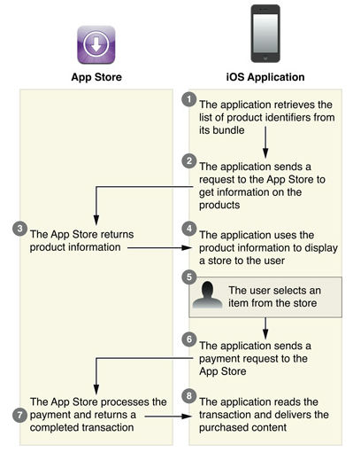
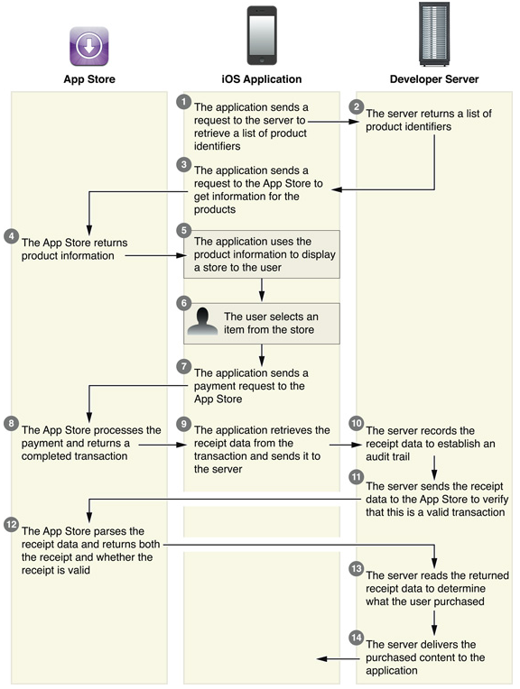
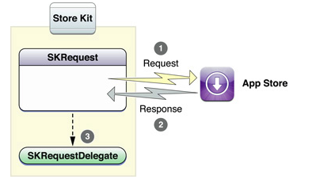
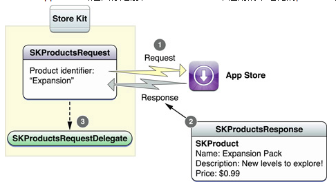
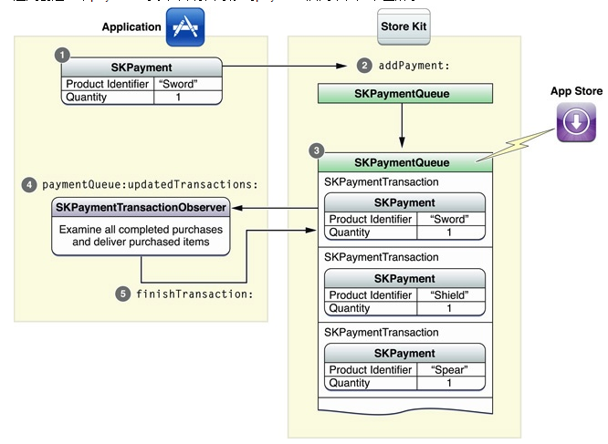

###In-App Purchase编程指南

####1.IAP简介

>在应用中内嵌Store，在iOS应用中使用Store Kit framework来实现In-App Purchase。Store Kit会连接App Store，代替应用安全地完成用户支付。Store Kit提示用户授权支付，然后通知应用“用户已经完成支付”，这样应用就可以提供用户购买的东西。

使用iap可以为应用的增强功能，或额外内容进行收费，如以下场景：
- 基础版本的应用，购买额外的特性
- 书籍阅读器应用，允许用户购买和下载新的书籍
- 游戏，提供新的环境（场景、关卡、等级等）
在线游戏，允许玩家购买虚拟财产（金币、道具、装备等）
- 数字杂志或newsletter订阅

####2.Products

可在iTunes Connect中定义，iap支持四种类型的product：

- Content（内容）：包括数字图书、杂志、照片、封面、游戏等级、游戏角色、以及其它应用可交付的数字内容
- Functionality（功能）：解锁或扩展应用当前已交付的特性。例如游戏中的多个小游戏，用户可单独购买
- Service（服务）：允许应用提供收费的一次性服务，每次使用服务都需要单独购买
- Subscription（订阅）：以扩展的方式，提供用户对内容或服务的访问。如应用提供每月财报或在线门户网站访问

所有的Product都必须先在App Store中通过iTunes Connect 注册，你需要提供一个唯一的product identifier，以及许多其它信息
应用使用Store Kit与App Store通信时；以及用户购买后，应用处理这个购买并提供product，都使用这个ID进行标识

product还可以分为以下类型：

- 消耗型，每次用户需要该产品时都需要购买。一次性服务通常都是消耗型
- 非消耗型，每个用户只需要购买一次，一旦购买，用户账号相关联的所有设备都可以使用。Store Kit 提供内建的支持，可在多个设备中使用非消耗型产品
- 自动再生订阅，和非消耗型一样递送至用户的所有设备。但是自动再生订阅在iTunes Connect中需指定订阅的持续时间。App Store在过期后自动更新该订阅。如果用户选择不允许订阅自动更新，在订阅过期后将自动取消，用户不能再访问该产品。应用负责验证某个订阅当前是否有效，并且可以获得最近交易的receipt
- 免费订阅，在Newsstand中提供免费订阅。用户一旦注册了免费订阅，账号相关的所有设备都可以访问该订阅的内容。免费订阅不会过期，而且只能在启用Newsstand的应用中提供
- 非自动再生订阅，创建受限持续时间订阅的旧机制，应使用自动再生订阅代替该机制。与自动再生订阅的区别有三点：

>> iTunes Connect中不指定订阅协议，应用负责提供这个信息给用户
>>可以被购买多次，App Store 不会自动更新该订阅。应用负责实现订阅更新，检测过期，提示用户重新购买。
>>应用必须将非自动再生订阅递送至用户的所有设备。Store Kit不会进行自动同步。


####3.如何交付已购买的iap特性

>应用需要设计和实现提供iap产品给用户的交付机制。目前主要有两种：内建模型、服务器模型。在这两种模型中，你都必须跟踪Store中已提供的products列表，并交付给用户使用。


#####3.1 内建模型

所有需要交付的products都已经包含在应用中。这个模型主要用于应用解锁相关的功能。也可以使用这个模型来交付应用Bundle中已经提供的内容。
内建模型的主要优点是可以快速地交付products给用户，多数内建型Products都应该是非消耗型的
应用可以在Application Bundle中存储Product Identifier，从而标识出相应的iap product。苹果推荐使用plist来记录所有内建特性的product ID。基于内容的应用可以使用这个技术来增加新的内容，而不需要修改应用的代码。
在用户成功购买product之后，应用必须解锁该特性，并且交付给用户使用。解锁特性最简单的方法是修改应用参数。应用参数在用户备份iOS设备时会自动备份，应用在用户购买product之后可以考虑推荐用户进行备份操作。

>内建模型示意图：



- 应用从Bundle中获取product ID列表
- 应用向App Store发送请求，以获取products的信息
- App Store返回Products信息
- 应用使用这些信息来显示一个Store给用户
- 用户从显示的Store中选择一项
- 应用向App Store发送payment请求
- App Store处理这个payment，并返回一个完成的transaction
- 应用读取transaction信息，并交付用户已购买的内容


#####3.2 服务器模型

在服务器模型中，我们提供一个独立的服务器，来交付Products给iOS应用。服务器交付适合于订阅、服务、内容，因为这些Products可以按数据来交付，而不需要修改iOS应用bundle。游戏也可以使用服务器来交付新的游戏环境（谜题、等级、或关卡）。Store Kit不管你的服务器与iOS应用之间如何交互；Store Kit也不提供标识特定用户的机制。你需要自己提供一个用户机制，来标识你iOS应用的用户（例如你提供订阅服务，需要与用户相关联，就需要自己实现用户机制）。

>服务器模型示意图：



- 应用发送请求到服务器，获取所有的Products ID列表
- 服务器返回Products ID列表
- 应用发送请求至App Store，获取Products的信息
- App Store返回Product信息
- 应用使用这些信息，向用户显示一个Store界面
- 用户从Store中选择一项
- 应用向App Store发送payment请求
- App Store处理该payment，并返回完成的transaction
- 应用从transaction中获取receipt数据，并将其发送给服务器
- 服务器记录receipt数据，并建立一个audit trail（审查跟踪）
- 服务器发送receipt数据到App Store，以验证是否合法的transaction
- App Store解析receipt数据，并返回receipt，以及验证结果（是否合法）
- 服务器读取返回的receipt数据，并确定哪个用户已经完成购买
- 服务器交付已购买的内容至iOS应用

应用最好通过你的服务器来获取Products标识，而不是直接存放在plist文件中。这样可以增加新Products，而无需更新应用。

在服务器模型中，应用获取transaction相关联的签名receipt，并且发送给服务器。服务器然后验证该receipt并对其进行解码，以确定需要向应用交付什么内容。

非消耗型products可以使用Store Kit内建的功能恢复，但是非自动再生订阅必须由你的服务器来还原。你负责记录非自动再生订阅的信息，并且还原给用户使用。消耗型Products也可以在服务器中记录，例如允许用户在多个设备上获取服务的结果。

####4.获取Product信息

>应用在显示Store给用户时，必须在界面上显示App Store中获取的信息。


####5.向App Store发送请求

>Store Kit提供通用的机制，向App Store发送请求。应用创建和初始化请求对象，指定一个delegate，就可以发起请求。App Store处理请求后，会异步地调用delegate来通知应用请求结果。如下图所示：



#####5.1 SKRequest

>SKRequest是一个抽象基类，用于向Store发送请求

#####5.2 SKRequestDelegate

>SKRequestDelegate是一个protocol，应用实现该接口，来处理Store成功或失败的结果


####6.获取Products的信息

>应用使用Products请求来获取本地化的product信息。应用创建一个请求，包含products ID字符串的列表。发起请求后，products ID会传输至App Store。App Store会返回你之前在iTunes Connect中注册的本地化的products信息。应用使用这些信息来显示Store



允许用户购买products之前，必须先使用该product ID向App Store查询详细的信息，这样才能确保product ID合法，而且在iTunes Connect中标记为可以销售。

#####6.1 SKProductsRequest

>SKProductsRequest对象使用一组product ID来创建，这些是你想要显示给用户的product列表

#####6.2 SKProductsRequestDelegate

>SKProductsRequestDelegate协议需要应用来实现，用于获取Store的响应信息。请求成功处理后，会异步地接收App Store的响应信息

#####6.3 SKProductsResponse

>SKProductsResponse对象是返回的结果信息，请求列表中的每个合法的product ID都有一个相应的SKProduct对象；同时还包含Store不能识别的一组product ID列表。不能识别的原因有许多：ID拼写错误、标记为不可销售、iTunes Connect中的修改还没有传送到其它App Store服务器等

#####6.4 SKProduct

>SKProduct对象提供你在App Store中注册的product的详细本地化信息

####7. Purchase（购买）

>当用户准备好购买product时，应用请求App Store来完成支付。App Store会创建一个持久化的transaction，即使用户退出和重新启动应用，也会继续地处理该支付交易。App Store将未决交易列表同步给应用，并且在任何交易状态变化时，递送更新信息给应用。


#####7.1 收集支付

>应用创建一个payment对象，并将其添加到payment队列中，如下图所示：




payment添加到队列中时，会创建一个持久化的交易来保存它。在payment处理完之后，交易会更新为收集支付之后的状态信息。应用实现observer来接收交易更新信息。observer负责提供已购买内容给用户，并且从payment队列中移除该交易

######7.1.1 SKPayment

>使用payment对象来收集支付。payment对象包含一个product ID，以及一个可选的购买数量。你可以把同一个payment对象排队多次，每排队一次都将导致一次单独的请求。
>用户可以在"设置"中禁用应用中购买。在排队一个购买请求之前，应用需要首先确认payment能够被处理，调用payment队列的canMakePayments方法。

######7.1.2 SKPaymentQueue

>payment队列用来与App Store通信。当payment添加到队列中时，Store Kit传输这个请求到App Store。Store Kit会显示对话框询问用户授权支付。完成的transaction会返回到应用的observer，以便应用处理。

######7.1.3 SKPaymentTransaction

>每个payment被添加到队列时，都会创建一个相应的transaction。每个transaction都有一些属性，允许应用确定该交易的状态。当支付收集完成后，transaction对象还包含额外的交易成功详细信息。
>虽然应用可以从payment队列中获取未决交易的列表，更通用的做法是应用等待，直到payment队列主动通知observer，并传递更新交易的列表。

######7.1.4 SKPaymentTransactionObserver

>应用的某个对象实现SKPaymentTransactionObserver协议，并把该对象添加为payment队列的observer。observer的主要责任是检查已完成的交易；递送已经成功购买的product；然后将这些完成交易从payment队列中移除。
>应用应该在启动时就关联observer到payment队列，而不是等到用户试图购买时才关联。transaction在应用终止后并不会丢失，下次应用启动时，Store Kit会继续处理这些交易。在应用初始化阶段添加observer，可确保所有交易都成功传递到应用。


#####7.2 还原交易

>一旦交易处理完成，并从队列中移除，应用通常不会再看到它。但是如果应用支持的product类型必须可还原，你就必须包含一个接口，允许用户还原这些购买。这个接口允许用户把已购买的product添加到其它设备，或者原始设备重置后，也需还原交易。

>Store Kit提供内建的机制，用于还原非消耗型、自动再生订阅、免费订阅等product的交易。应用调用payment队列的restoreCompletedTransactions方法，payment队列就会发送一个请求到App Store来还原交易。而App Store则对所有之前已经完成的交易生成一个新的还原交易。还原交易对象的originalTransaction属性保存了原始的交易。应用对还原交易进行处理，从中获取原始交易，然后使用这个原始交易对象来解锁用户已购买的内容。在Store Kit还原了之前完成的交易时，会通知payment队列的observer对象，并调用它的paymentQueueRestoreCompletedTransactionsFinished: 方法。

>如果用户试图购买一个可还原的product（而不是使用你实现的还原接口），应用会接收到一个正常的交易，而不是可还原交易。但是用户不需要再次为这个product支付。应用应该把这些交易当作原始交易一样来处理。

>非自动再生订阅和可消耗型product不会被Store Kit自动还原。但是非自动再生订阅又必须可还原，因此在购买这些product时，你必须在自己的服务器上记录这些交易，并提供自己的机制来还原这些交易给用户的所有设备。

####8. 应用中添加Store（内建模型）

>首先确保项目链接了StoreKit.framework，应用中添加Store的详细步骤如下：

1. 定义应用需要递送的products。
Store Kit对products有一些限制，不允许应用对自己打补丁，或者下载额外的代码。products要么已经在应用的现有代码中，要么从远程服务器下载数据文件来实现。如果应用增加特性需要修改现有代码，必须发布一个新版本的应用。

2. 在iTunes Connect中为每个product注册详细信息
每次应用Store要增加一个新的product，都需要先在iTunes Connect中进行注册。每个product都需要一个唯一的ID字符串。App Store使用这个字符串来查找product信息以及处理支付请求。product ID特定于iTunes Connect账号，注册的方式与注册应用类似。

3. 确定系统能够处理支付
用户可以禁止应用内购买，因此你的应用需要先检查当前是否支持应用内购买。应用可以在显示Store给用户之前，或者在实际发起购买请求之前，进行这项检查。后者允许用户查看能够购买的products，即使应用内购买当前被禁止。

```
if ([SKPaymentQueue canMakePayments])
{
   ... // 向用户显示Store
}
else
{
   ... // 警告用户当前禁止应用内购买
}
```
4. 获取products的信息
应用创建一个SKProductsRequest对象，并初始化为一组你想要销售的product ID，添加一个delegate处理请求返回结果，然后就可以发起这个请求。响应结果保存了所有合法的products的本地化信息。应用必须首先获得product的信息，然后才能创建payment请求。

```
- (void) requestProductData
{
   SKProductsRequest *request= [[SKProductsRequest alloc] initWithProductIdentifiers: [NSSet setWithObject: kMyFeatureIdentifier]];
   request.delegate = self;
   [request start];
}
- (void)productsRequest:(SKProductsRequest *)request didReceiveResponse:(SKProductsResponse *)response
{
    NSArray *myProduct = response.products;
    // 把信息显示到Store界面
    [request autorelease];
}
```

5. 增加一个用户界面，显示products给用户
Store Kit不提供用户界面类，如何显示Store给用户是应用的事情。

6. 注册一个transaction observer到payment队列
应用实例化一个transaction observer，并将其注册到payment队列。

```
MyStoreObserver *observer = [[MyStoreObserver alloc] init];
[[SKPaymentQueue defaultQueue] addTransactionObserver:observer];
```

如前所述，应用最好在启动时注册observer。交易完成之前应用退出，App Store也仍然记得这些交易。启动时注册observer确保所有之前排队交易的结果都能够被应用接收到。

7. 在应用的MyStoreObserver对象中实现paymentQueue:updatedTransactions: 方法
observer的paymentQueue:updatedTransactions: 方法在新交易被创建或更新时都会被调用

```
- (void)paymentQueue:(SKPaymentQueue *)queue updatedTransactions:(NSArray *)transactions
{
    for (SKPaymentTransaction *transaction in transactions)
    {
        switch (transaction.transactionState)
        {
            case SKPaymentTransactionStatePurchased:
                [self completeTransaction:transaction];
                break;
            case SKPaymentTransactionStateFailed:
                [self failedTransaction:transaction];
                break;
            case SKPaymentTransactionStateRestored:
                [self restoreTransaction:transaction];
            default:
                break;
        }
    }
}
```

8. observer在用户成功购买后提供相应的product

```
- (void) completeTransaction: (SKPaymentTransaction *)transaction
{
// 应用需要实现这两个方法：记录交易、提供内容
    [self recordTransaction: transaction];
    [self provideContent: transaction.payment.productIdentifier];
// 从payment队列中删除交易
    [[SKPaymentQueue defaultQueue] finishTransaction: transaction];
}
```

成功的交易包含一个transactionIdentifier属性和一个transactionReceipt属性，记录了已处理支付的详细信息。应用不需要对这些信息做任何处理。当然你可能希望记录这些信息并为交易建立一个审查跟踪（audit trail）。如果使用服务器来递送内容，应用可以把receipt发送到服务器，然后由服务器向App Store验证该交易。

一旦你完成交付product给用户，应用必须调用finishTransaction: 来完成交易，交易将从payment队列中移除。为了确保products不会丢失，应用应该在调用finishTransaction: 之前交付内容。

9. 处理还原购买，结束交易

```
- (void) restoreTransaction: (SKPaymentTransaction *)transaction
{
    [self recordTransaction: transaction];
    [self provideContent: transaction.originalTransaction.payment.productIdentifier];
    [[SKPaymentQueue defaultQueue] finishTransaction: transaction];
}
```

这个方法类似于上面的购买。还原购买是一个新的交易，拥有不同的transaction ID和receipt。你可以单独保存这些信息，并建立审查跟踪。但是当完成交易时，你还是要还原原始的交易，那里面保存了实际的payment对象和product ID。

10. 处理失败购买，结束交易

```
- (void) failedTransaction: (SKPaymentTransaction *)transaction
{
    if (transaction.error.code != SKErrorPaymentCancelled)
    {
        // 可以显示一个错误（可选的）
    }
    [[SKPaymentQueue defaultQueue] finishTransaction: transaction];
}
```

通常交易失败都是用户决定不购买。应用可以读取失败交易的error域，从而了解为何交易失败。
对于失败的交易，应用唯一需要做的是从队列中移除它。如果应用在交易失败后显示一个对话框告诉用户交易出错，应该避免在用户主动取消时也显示该错误。

11. 做完上面所有以后，你就可以显示用户界面。当用户在Store中选择一项时，应用就创建一个payment对象，并将其添加到payment队列中。

```
SKPayment *payment = [SKPayment paymentWithProductIdentifier:kMyFeatureIdentifier];
[[SKPaymentQueue defaultQueue] addPayment:payment];

如果Store提供一次购买多个product的功能，你可以创建一个payment对象，并指定quantity属性
SKMutablePayment *payment = [SKMutablePayment paymentWithProductIdentifier:kMyFeatureIdentifier];
payment.quantity = 3;
[[SKPaymentQueue defaultQueue] addPayment:payment];
```

以上的代码示例主要用于内建product模型。如果你的应用使用服务器来交付内容，你需要设计和实现iOS应用与服务器之间通信的协议。你的服务器还需要在交付products给应用之前，先验证receipts。

####9. 验证Store receipt

>应该接收到Apple Store Kit的receipt后，应该执行额外的receipt检查，来验证交易的合法性。如果应用依赖于独立的服务器来提供订阅、服务、可下载内容，验证receipt就非常重要。服务器验证receipt可确保iOS应用向服务器的请求是合法的。

Store receipt的内容和格式是私有的，并且有可能变化。应用不能试图直接解析receipt数据。使用下面描述的机制来验证receipt，并获得receipt中存储的信息。

#####9.1 向App Store验证一个Receipt
当Store Kit返回一个完成的购买到payment队列的observer时，交易的transactionReceipt属性包含一个签名的receipt，记录了所有关键的交易信息。服务器可以post这个receipt到App Store，来验证receipt是合法的，没有被篡改。向App Store查询使用JSON dictionary直接发送和接收，由RFC 4627定义。

执行以下步骤，来验证receipt：
1. 从transaction的transactionReceipt属性获取receipt数据，并使用Base64对其进行编码
2. 创建一个JSON对象，只有一个名为"receipt-data"的键，它的值是步骤1创建的字符串。JSON对象如下：

```
{
    "receipt-data" : "(actual receipt bytes here)"
}
```

3. 使用HTTP POST请求，Post这个JSON对象到App Store，URL为：`https://buy.itunes.apple.com/verifyReceipt`
4. 从App Store接收到的响应也是一个JSON对象，有两个键：status和receipt。如下所示：

```
{
    "status" : 0,
    "receipt" : { ... }
}
```
如果status的值为0，表示是一个合法的receipt。否则receipt非法。


#####9.2 Store Receipt

>你发送给App Store的receipt数据编码了交易的信息。当App Store验证receipt时，会先解码receipt数据，并在响应中返回。receipt响应是一个JSON dictionary，包含了应用中SKPaymentTransaction对象的所有信息。因此服务器可以查询这些JSON域，来获取用户购买的详细信息。苹果推荐iOS应用只发送receipt数据给服务器，不发送交易数据给服务器，然后服务器再到App Store去验证receipt。App Store会验证receipt数据没有被篡改。服务器从App Store响应的receipt数据中获取交易信息，而不是由iOS应用直接发送交易信息给服务器，会更加安全。

下表列出了你可以从响应receipt中获取的信息，许多键直接对应于SKPaymentTransaction类的属性。表中没有指定的键都被苹果保留，不得使用。

|  插件名称 | 描述	|
|---|----|
|quantity    |购买的数量，对应于transaction.payment.quantity属性|
|product_id  |product ID标识，对应于transaction.payment.productIdentifier属性|
|transaction_id | transaction ID标识，对应于transaction.transactionIdentifier属性|
|purchase_date   |交易发生的日期和时间，对应于transaction.transactionDate属性|
|original_transaction_id |对于还原交易，这个值保存了原始交易ID|
|original_purchase_date  |对于还原交易，这个值保存了原始交易日期|
|app_item_id |字符串，App Store用来唯一地标识一个创建了支付交易的iOS应用。如果你的服务器支持多个iOS应用，你可以使用这个值来区分不同的应用。在sandbox中运行的应用没有app_item_id，因此这个键也不存在|
|version_external_identifier |唯一标识你的应用修订版本的任意数值。sandbox应用没有这个键|
|bid |iOS应用的Bundle ID|
|bvrs |   iOS应用的版本号|

>与苹果的验证接口文档在[这里](https://developer.apple.com/library/ios/releasenotes/General/ValidateAppStoreReceipt/Introduction.html#//apple_ref/doc/uid/TP40010573-CH105-SW1)。简单来说就是将该购买凭证用Base64编码，然后POST给苹果的验证服务器，苹果将验证结果以JSON形式返回。
>[具体代码示例](https://github.com/wenzhucjy/GeneralUtils/tree/master/src/main/java/com/github/mysite/common/payonline/appStorePay)

####10. 测试Store

在开发过程中，你需要测试应用Store来确保正常工作。但是又不能进行实际的用户支付，因此需要使用苹果提供的sandbox Store测试。Store Kit不能在iOS模拟器中使用，测试Store必须在真机上进行。

#####10.1 Sandbox环境

>从Xcode启动应用时，Store Kit不会连接到App Store。相反会连接到特殊的Sandbox Store环境。Sandbox环境使用了App Store的基础架构，但是不会发生实际的支付。Sandbox环境返回成功的支付，就好像实际上购买了一样。Sandbox环境使用特殊的iTunes Connect账号，只能用于测试In-App Purchase。不能使用普通的iTunes Connect账号在Sandbox中测试。

>你需要在iTunes Connect中创建一个或多个特殊的测试账号，至少每个本地化区域需要一个单独的测试账号。详细的信息可参考iTunes Connect Developer Guide.

#####10.2 Testing in the Sandbox

>按以下步骤，在Sandbox中进行测试：

1. 在测试的iOS设备中退出当前iTunes账号
在测试应用之前，必须首先退出普通的iTunes账号。iOS 3.0在设置程序中包含了一个Store类别，你可以在里面退出当前账号
切记：不要在设置中登录你的测试账号，否则测试账号将失效

2. 运行你的应用
一旦你退出了普通账号，就可以在Xcode中运行你的应用。在应用中提交支付时，Store Kit会提示你授权交易。使用测试账号登录并同意支付。这时候不会发生扣款，但是交易会正常完成。

#####10.3 在Sandbox中验证Receipts

>你也可以在Sandbox中验证receipt，执行验证的代码和普通App Store是一样的，但是Sandbox环境的URL不一样：

```
NSURL *sandboxStoreURL = [[NSURL alloc] initWithString: @"https://sandbox.itunes.apple.com/verifyReceipt"];
```

####11. Auto-Renewable订阅

>In-App Purchase提供标准化的方式，来实现自动再生订阅。自动再生订阅拥有以下特性：

1. 在iTunes Connect中配置自动再生订阅时，需要指定订阅的持续时间，以及其它选项。
2. Auto-renewable订阅会自动还原，而且和非消耗型product一样，都使用相同的Store Kit函数。原始交易，和每次的再生交易都会发送到应用。
3. 服务器向App Store验证receipt时，如果订阅活跃，并且被App Store自动再生过，App Store会返回一个更新的receipt

#####11.1 添加自动再生订阅到Store

>按以下步骤实现auto-renewable订阅：

1. 连接到iTunes Connect，并创建一个新的"shared secret"。shared secret是一个密码，服务器在验证auto-renewable订阅的receipt时必须提供此密码。这样在与App Store之间就增加了一层额外的安全保护。
2. 在iTunes Connect中新增并配置一项新的auto-renewable订阅类型
3. 修改服务器的receipt验证代码，在发送到App Store的receipt JSON数据中增加shared secret。服务器的验证代码必须解析App Store的响应数据，以确定订阅是否过期。如果订阅被用户更新，App Store会返回最新的receipt给你的服务器。

#####11.2 设计你的iOS客户端应用

>多数情况下，iOS应用只需要很小的修改，就能支持auto-renewable订阅。实际上，客户端应用现在变得更加简单，因为你可以使用相同的代码还原auto-renewable订阅，做法和还原非消耗型product一样：应用在订阅更新时，会接收到独立的transaction，应用只需单独验证每个receipt即可。

#####11.3 验证Auto-renewable订阅Receipt

>和前面验证Store Receipts几乎相同。创建JSON对象，并POST到App Store。唯一的区别是增加第二个域：shared secret，也就是你在iTunes Connect创建的那个

```
{
    "receipt-data" : "(actual receipt bytes here)"
    "password"     : "(shared secret bytes here)"
}
```

>响应包含一个status域，表示receipt是否通过验证

```
{
    "status" : 0,
    "receipt" : { ... }
    "latest_receipt" : "(base-64 encoded receipt)"
    "latest_receipt_info" : { ... }
}
```

>如果用户的receipt合法，而且是活跃的订阅，status域为0，receipt域包含解码后的receipt数据。如果服务器接收到的status为非0值，可对应以下错误代码，来解析相应的错误。
|  Status | 描述	|
|---|----|
|21000   |App Store不能读取你提供的JSON对象|
|21002  | receipt-data域的数据有问题|
|21003   |receipt无法通过验证|
|21004  | 提供的shared secret不匹配你账号中的shared secret|
|21005  | receipt服务器当前不可用|
|21006  | receipt合法，但是订阅已过期。服务器接收到这个状态码时，receipt数据仍然会解码并一起发送|
|21007 |  receipt是Sandbox receipt，但却发送至生产系统的验证服务|
|21008  | receipt是生产receipt，但却发送至Sandbox环境的验证服务|

>注意：这里的状态码只能用于Auto-renewable订阅，其它类型的product不能使用这些状态码进行判断

App Store返回给你的服务器的JSON对象的receipt数据中，除了前面说过的几个键，增加或修改了以下几个键：

|  键| 描述	|
|---|----|
|expires_date   | 订阅receipt的过期日期，GMT至今的秒数，还原交易时不包含这个键|
|original_transaction_id |最初购买时的transaction ID，随后的订阅更新和还原都共享这个ID
|original_purchase_date | 最初购买的日期，表示订阅的起始日期|
|purchase_date |  交易支付发生的日期，对于renewable订阅，这也可能是最近一次订阅更新的日期。|

另外JSON还包含两个额外的域：latest_receipt、latest_expired_receipt_info，这两个都是receipt对象，你的服务器可以使用这两个域来记录最近的订阅更新。

#####11.4 还原Auto-Renewable订阅
App Store在每次更新订阅时都会创建独立的transaction。你的应用还原之前的购买时，Store Kit会把所有transaction都传递给应用。因此应用需要组合每个transaction的购买日期与订阅长度，然后确定该receipt是否合法。

FROM:
http://blog.csdn.net/lixuwen521/article/details/8103949
