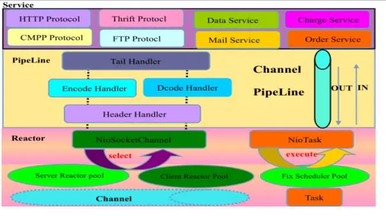

### Netty 备忘录


#### 操作系统对IO的支持

对Linux系统来说，所有文件、socket的操作都是针对文件描述符的，对IO的操作分5种：

+ 阻塞IO  —— 调用recvfrom时，如果没有任何信息，则调用被阻塞，有传入信息时，调用返回
+ 非阻塞IO —— recvfrom 没有数据的话，返回一个错误，轮询检查错误状态，看是否有数据
+ IO复用 —— 提供 select/poll 方式，进程对每个 socket 的 fd 顺序扫描，查看是否就绪，阻塞在 select 上；如果就绪，调用 recvfrom ，同时提供 epoll ，不是顺序扫描，而是提供回调函数，当 fd 就绪时，调用回调函数，进一步提高效率
+ 信号驱动IO —— 当数据就绪时，生成 SIGIO 信号
+ 异步IO —— 当内核完成整个操作时（将数据从内核拷贝到用户缓冲区后），发出通知

#### Java 原生的 NIO

Java NIO 是基于 epoll 开发的非阻塞式IO

+ 支持打开的 socket 数量仅受到操作系统最大文件句柄数量限制；传统的 select/poll 方式的最大句柄数量是 1024，如果需要改变，则需要修改 FD_SETSIZE 重新编译内核
+ Select/epoll 采用回调方式而不是顺序轮序，对于大多数连接不活动的情况下，效率远高于 select/poll 方式，不会随着 fd 的数量增加而又较大的效率下降
+ Select/poll/epoll 都需要将内核将消息通知用户控件，需要进行内核和用户空间的内存复制，epoll 采用 mmap 方式进行内核和用户空间的内存共享
+ NIO 2.0 开始支持基于时间驱动的 IO 方式
+ 基于 epoll 的实现可能会出现空轮序以至于 CPU 飙升至 100%

#### TCP 与 UDP

+ TCP (Transmission Control Protocol) ：传输控制协议，在进行服务器与客户端的通信时，会对数据传输进行校验，防止因网络问题导致的丢包与乱序问题
+ UDP (User Data Protocol) ：用户数据报协议，在服务器与客户端的通信过程中，不对数据的有效性进行校验，即发送端不在乎接收端是否接收到正确有序的数据

#### Netty 简介

+ Netty是由JBOSS提供的一个java开源框架，提供异步的、事件驱动的网络应用程序框架和工具，用以快速开发高性能、高可靠性的网络服务器和客户端程序。Netty是一个基于NIO的客户，服务器端编程框架，使用Netty可以快速和简单的开发出一个网络应用，Netty相当简化和流线化了网络应用的编程开发过程，如，TCP和UDP的socket服务开发。支持HTTP、 WebSocket 、Protobuf、 Binary TCP |和UDP、各种二进制，文本协议，在保证易于开发的同时还保证了其应用的性能，稳定性和伸缩性

#### Netty 特点

- 异步、非阻塞、基于事件驱动的NIO框架
- 支持多种传输层通信协议，包括TCP、UDP等
- 开发异步HTTP服务端和客户端应用程序
- 提供对多种应用层协议的支持，包括TCP私有协议、HTTP协议、WebSocket协议、文件传输等
- 默认提供多种编解码能力，包括Java序列化、Google的ProtoBuf、二进制编解码、Jboss marshalling、文本字符串、base64、简单XML等，这些编解码框架可以被用户直接使用，采用多种 decoder/encoder 支持，对粘包/分包进行自动化处理
- 提供形式多样的编解码基础类库，可以非常方便的实现私有协议栈编解码框架的二次定制和开发
- 经典的ChannelFuture-listener机制，所有的异步IO操作都可以设置listener进行监听和获取操作结果
- 基于ChannelPipeline-ChannelHandler的责任链模式，可以方便的自定义业务拦截器用于业务逻辑定制
- 安全性：支持SSL、HTTPS
- 可靠性：流量整形、读写超时控制机制、缓冲区最大容量限制、资源的优雅释放等
- 简洁的API和启动辅助类，简化开发难度，减少代码量
- 对 epoll 空轮询引起的 CPU 占用飙升在内部进行了处理，避免了直接使用 NIO 的陷阱

#### Netty 应用领域

Netty在互联网领域、大数据分布式计算领域、游戏行业、通信行业等获得了广泛的应用，一些业界著名的开源组件也基于Netty的NIO框架构建

- 分布式进程通信
  例如 hadoop、dubbo、akka等具有分布式功能的框架，底层RPC通信都是基于netty实现，这些框架的版本通常都还是在 netty 3.x

- 游戏服务器开发
  最新的服务器有部分公司已经开始使用netty 4.x 或 netty 5.x

#### 逻辑架构



- Reactor 通信调度层：它由一系列辅助类完成，包括 Reactor 线程 NioEventLoop 以及其父类、NioSocketChannel/NioServerSocketChannel 以及其父类、ByteBuffer 以及由其衍生出来的各种 Buffer、Unsafe以及其衍生出的各种内部类等。该层的主要职责就是监听网络的读写和连接操作，负责将网络层的数据读取到内存缓冲区中，触发各种网络事件，例如连接创建、连接激活、读事件、写事件等等，将这些事件触发到 PipeLine 中，由 PipeLine 充当的职责链来 进行后续的处理

- 职责链 PipeLine ：它负责事件在职责链中的有序传播，同时负责动态的编排职责链，职责链可以选择监听和处理自己关心的事件，它可以拦截处理和向后/向前传播事件，不同的应用的 Handler 节点的功能也不同，通常情况下，往往会开发编解码 Hanlder 用于消息的编解码，它可以将外部的协议消息转换成内部 的 POJO 对象，这样上层业务侧只需要关心处理业务逻辑即可，不需要感知底层的协议差异和线程模型差异，实现了架构层面的分层隔离

- 业务逻辑处理层：第一类，纯粹的业务逻辑 处理，例如订单处理；第二类：应用层协议管理，例如HTTP协议、FTP协议等

#### 线程模型

- Netty是基于NIO的通信框架，为什么要使用NIO而不是用传统的BIO通信机制呢，因为在BIO的线程模型上，存在着致命缺陷，由于线程模型问题，接入用户数与服务端创造线程数是1:1的关系，也就是说每一个用户从接入断开连接，服务端都要创造一个与之对应的线程做处理，一旦并发用户数增多，再好配置的服务器也有可能会有因为线程开销问题造成服务器崩溃宕机的情况。除此之外，BIO的所有IO操作都是同步的，当IO线程处理业务逻辑时，也会出现同步阻塞，其他请求都要进入阻塞状态

- NIO的通信机制可以很好地解决BIO的线程开销问题，NIO采用Reactor通信模式，一个Reactor线程聚合一个多路复用Selector，这个Selector可同时注册、监听、轮回上百个Channel请求，这种情况下，一个IO线程就可以处理N个客户端的同时接入，接入用户数与线程数为N:1的关系，并且IO总数有限，不会出现频繁上下文切换，提高了CPU利用率，并且所有的 IO 操作都是异步的，即使业务线程直接进行IO操作，也不会被同步阻塞，系统不再依赖外部的网络环境和外部应用程序的处理性能

#### Reactor 模型

- Java NIO非堵塞技术实际是采取反应器模式，或者说是观察者(observer)模式为我们监察I/O端口，如果有内容进来，会自动通知我们，这样，我们就不必开启多个线程死等，实现了流畅的I/O读写

- netty中两种类型的发动机，驱动着netty整个框架的运转，一种类型的reactor线程是boos线程组，专门用来接受新的连接，封装成channel对象扔给worker线程组；还有一种类型的reactor线程是worker线程组，专门用来处理连接的读写。boos线程还是worker线程的处理步骤：

```
轮询注册在selector上的IO事件

处理IO事件

执行异步task
```

- 对于 boos 线程来说，第一步轮询出来的基本都是 accept 事件，表示有新的连接，而 worker 线程轮询出来的基本都是 read/write 事件，表示网络的读写事件

#### 心跳

- Netty 提供的读写空闲

```
读空闲 READER_IDLE：一段时间内没有数据接收，链路持续时间t没有读取到任何消息

写空闲 WRITER_IDLE：一段时间内没有数据发送，链路持续时间t没有发送任何消息

读写空闲 ALL_IDLE：一段时间内没有数据接收或者发送
```

- 在 Netty 的 timeout 包下，主要类有

```
IdleStateEvent ： 超时的事件
IdleStateHandler ： 超时状态处理
ReadTimeoutHandler ： 读超时状态处理
WriteTimeoutHandler ： 写超时状态处理
```

- 心跳检测机制

```
TCP层面：即TCP的Keep-Alive机制，它的作用域是整个TCP协议栈

协议层：主要存在于长连接协议中。例如SMPP协议

应用层测：它主要由各业务产品通过约定方式定时给对方发送心跳消息实现
```

- 心跳应用示例

```

心跳对于服务端来说，定时清除闲置会话 inactive(netty5) channelClose(netty3)；对客户端来说，用于检测会话是否断开，是否重连，用来检测网络延时

IP地址黑名单机制，若一秒发送超过请求次数，获取IP地址并列入黑名单

玩家下线，抛出一个事件，服务器进行清理玩家缓存
```

#### Netty 编解码技术

Netty 编解码技术就是 Java 的序列化技术，序列化目的：一是进行网络传输，二是对象持久化，主流的编解码框架：

- Netty 自带的 ObjectEncoder、ObjectDecoder

> Netty自带的ObjectEncoder、ObjectDecoder（对象编码、解码器），该编码、解码器基于的是Java的原生序列化机制，Java的原生序列化性能效率不高，而且产生的序列化二进制码流太大

- JBoss 的 Marshalling 包

> JBoss Marshalling 是一个 Java 对象序列化包，对 JDK 默认的序列化进行了优化，但又保持跟 java.io.serializable 接口的兼容，同时增加了一些可调的参数和附加特性。类库 jboss-marshalling-1.3.0  jboss-marshalling-serial-1.3.0

- Google 的 Protobuf

> Protobuf 是谷歌推出的与语言无关、平台无关的通信协议，一个对象经过 Protobuf 序列化后将变成二进制格式的数据，可读性差，但换来的是占用空间小，速度快，使用 Protobuf 要先使用特定的语法编写一个 .proto 文件，该文件与语言无关，然后使用特殊的编译器对该文件进行编译，生成与语言相关的文件；升级时均支持向后兼容和向前兼容；官方文档较为丰富，功能单一，容易学习

- 基于 Protobuf 的 Kyro

> Kyro 相比Java本地原生序列化方式，Kryo在处理性能上、码流大小上等方面有很大的优化改进，alibaba开源的dubbo RPC 使用的是 Kyro 序列化方式

- 基于 Protobuf 的 Protostuff

> Protostuff 一个基于 Protobuf 的产品，不需要依赖.proto文件，直接对普通的javabean进行序列化、反序列化的操作；优势是将开发流程简化，可以更高效，更专注地开发

- MessagePack 框架

- Facebook 的 Thrif

> Thrift 最初是由 Facebook 开发提供了全套RPC解决方案，包括序列化机制、传输层、并发处理框架等

> Thrift通过接口定义语言 (interface definition language，IDL) 来定义数据类型和服务，Thrift接口定义文件由Thrift代码编译器生成thrift目标语言的代码（目前支持C++,Java, Python, PHP, Ruby, Erlang, Perl, Haskell, C#, Cocoa, Smalltalk和OCaml），并由生成的代码负责RPC协议层和传输层的实现

> `Thrift`功能较`Protobuf`丰富，但官方文档较少，没有API文档

#### 粘包/分包

- TCP粘包是指发送方发送的若干包数据到接收方接收时粘成一包，从接收缓冲区看，后一包数据的头紧接着前一包数据的尾

- 解决粘连包的方法

```
发送方开启TCP_NODELAY

接收方简化或者优化流程尽可能快的接收数据

认为强制分包每次只读一个完整的包
```

- Netty自带的几种粘包解决方案

```
DelimiterBasedFrameDecoder   带有分隔符协议的解包组包

FixedLengthFrameDecoder  固定长度解包组包

LengthFieldBasedFrameDecoder  消息头固定长度，消息体不固定长度协议解包组包
```

#### 通信时序图

- 服务端通信序列图


```
1.创建ServerBootstrap实例，ServerBootstrap实例中需要两个NioEventLoopGroup实例，分别为boss和work：boss线程负责监听端口及请求的accept操作；work负责请求的read、write及处理操作，默认线程数量是当前CPU核心线程数量的2倍

NioEventLoopGroup主要负责管理eventLoop的生命周期，eventLoop数量默认为处理器个数的两倍

2.设置并绑定Reacotr线程池。Netty的Reactor线程池是EventLoopGroup
EventLoop会处理所有注册到本线程多路复用器Selector上Channel

3.设置并绑定服务端的Channel

4.链接建立的时候创建并初始化ChannelPipeline。(一个负责处理网络时间的职责链,负责变量和执行ChanelHandler)网络事件以事件流的形式在ChannelPipeline中流转，有ChannelPipeline根据ChannelHnadler的执行策略调用ChannelHandler执行

5.添加并绑定ChannelHandler。该类是Netty提供给用户定制和扩展的关键接口。利用该接口,用户客户完成大多数的功能定制，例如消息解码、心跳、安全认证、TSL/SSL认证、流量控制等

6.绑并启动端口监听

7.selector轮询，由Reactor线程的NioEventLoop负责调度和执行Selector轮询，选择准备就绪的Channel集合

8.当轮询掉准备就绪的Channel之后,就由Reactor线程NioEventLoop执行ChannelPipeline的相应方法,最终调用并执行ChannelHandler
```

- 客户端通信序列图


#### 有效规避内存泄漏

- 从 netty4 开始，对象的生命周期由它们的引用计数（reference counts）管理，而不是由垃圾收集器（garbage collector）管理了

> Netty 四中ByteBuf

- `UnpooledHeapByteBuf` 底下的byte[]能够依赖JVM GC自然回收
- `UnpooledDirectByteBuf` 底下是 `DirectByteBuffer` ，如Java堆外内存扫盲贴所述，除了等JVM GC，最好也能主动进行回收
- `PooledHeapByteBuf` 和 `PooledDirectByteBuf` ，则必须要主动将用完的byte[]/ByteBuffer放回池里，否则内存就要爆掉。因此，Netty ByteBuf需要在JVM的GC机制之外，有自己的引用计数器和回收过程

> Handler对消息处理方式

- 不做处理，调用 ctx.fireChannelRead(msg) 把原消息往下传，不用做释放
- 将原消息转化为新的消息并调用 ctx.fireChannelRead(newMsg) 往下传，把原消息release掉
- 在Handler链的最末补一个 `TailHandler`，如果此时消息仍然是`ReferenceCounted`类型就会被release掉，
若业务Hanlder不再把消息往下传了，由`TailHandler`负责release

> 内存泄漏检测

- 内存泄漏，主要是针对池化的ByteBuf，ByteBuf对象被JVM GC掉之前，没有调用release()去把底下的DirectByteBuffer或byte[]归还到池里，会导致池越来越大

- 默认的防漏等级是`simple`，表示取样的1%的ByteBuf是否发生了泄露，但总共一次只打印一次，看不到就没有了，另外还有：禁用（DISABLED） - 完全禁止泄露检测，省点消耗；高级（ADVANCED）- 取样的1%的ByteBuf发生泄露的地方，每种类型的泄漏（创建的地方与访问路径一致）只打印一次；偏执（PARANOID） - 跟高级选项类似，但此选项检测所有ByteBuf，而不仅仅是取样的那1%。在高压力测试时，对性能有明显影响。通过`'-Dio.netty.leakDetectionLevel=advanced'`指定


#### Netty 网络编程

Netty 的核心在整个 channel pipeline

- Pipeline 是一个队列，包含了两种处理器： ChannelInboundHandlerAdapter 和 ChannelOutboundHandlerAdapter

- ChannelInboundHandlerAdapter 负责处理进入的 ByteBuf或其他内容

- ChannelOutboundHandlerAdapter 负责处理输出的 ByteBuf或其他内容

- Pipeline 是一个 ChannelHandler 队列，在输入时，按照从头到尾遍历所有的 ChannelInboundHandlerAdapter ；在输出时，按照从尾到首遍历所有的 ChannelOutboundHandlerAdapter

- 两个 NioEventLoopGroup 分别创建两个线程池，负责 accept 和 read

- DelimiterBasedFrameDecoder,LineBasedFrameDecoder,FixedLengthFrameDecoder,LengthFieldBasedFrameDecoder 分别表示分隔符标识的消息组、换行符标识的消息组、固定长度的消息组、长度开始的消息组

#### Netty 与 Mina 比较

- 都是Trustin Lee的作品，Netty更晚
- Mina将内核和一些特性的联系过于紧密，使得用户在不需要这些特性的时候无法脱离，相比下性能会有所下降，Netty解决了这个设计问题
- Netty的文档更清晰，很多Mina的特性在Netty里都有
- Netty更新周期更短，新版本的发布比较快
- Mina靠apache生存，而Netty靠jboss，和jboss的结合度非常高，Netty有对google protocal buf的支持，有更完整的ioc容器支持(spring,guice,jbossmc和osgi)
- Netty比Mina使用起来更简单，Netty里你可以自定义的处理upstream events 或/和 downstream events，可以使用decoder和encoder来解码和编码发送内容
- Netty和Mina在处理UDP时有一些不同，Netty将UDP无连接的特性暴露出来；而Mina对UDP进行了高级层次的抽象，把UDP当成"面向连接"的协议，而要Netty做到这一点比较麻烦

#### Netty 最佳实践

- 数据通信

> 使用长连接通道不断开的形式进行通信，也就是服务器和客户端的通道一直处于开启状态，如果服务器性能足够好，并且客户端的数量也较少，推荐使用这种方式

> 一次性批量提交数据，采用短连接方式，也就是会把数据保存在本地临时缓冲区或临时表里，当达到临界时进行一次性批量提交，又或者根据定时任务轮询提交，这种弊端做不到实时性传输，在对实时性不高的应用程序中可以推荐使用

> 使用一种特殊的长连接，在指定某一时间之内，服务器与某台客户端没有任何通信，则断开连接，下次连接则是客户端向服务器发送请求的时候，再次建立连接，得考虑以下因素：

1. 如何在超时（即服务器和客户端没有任何通信）后关闭通道，关闭通道再次建立连接问题

2. 客户端宕机时，无需考虑，下次客户端重启之后，就可以与服务器建立连接，但是服务器端宕机，客户端如何与服务器进行连接

#### 参考

- [Netty 4.0 新的特性](http://www.oschina.net/translate/netty-4-0-new-and-noteworthy?print)

- [netty源码分析之揭开reactor线程的面纱（一）](http://www.jianshu.com/p/0d0eece6d467)

- [netty源码分析之揭开reactor线程的面纱（二）](http://www.jianshu.com/p/467a9b41833e)

- [netty源码分析之揭开reactor线程的面纱（三）](http://www.jianshu.com/p/58fad8e42379)

- [netty源码分析之服务端启动全解析](http://www.jianshu.com/p/c5068caab217)

- [netty源码分析之新连接接入全解析](http://www.jianshu.com/p/0242b1d4dd21)

- [Netty之有效规避内存泄漏](http://m635674608.iteye.com/blog/2236834)
