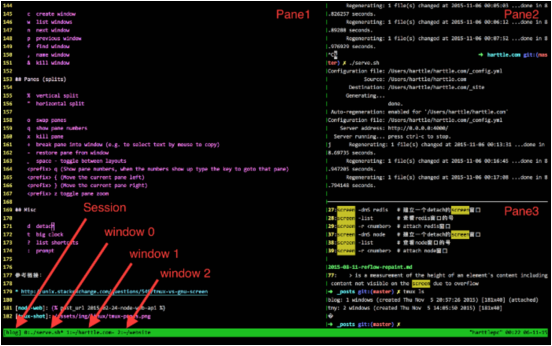

### `Tmux`多路复用

#### 1.简介
`Screen`/`Tmux` 是远程ssh session的管理工具，`Screen`是GNU软件，而`Tmux`是BSD的协议,主要的区别是`Tmux`支持Vi/Emacs风格的键盘映射，更好的接口和文档，以及更好的脚本控制，可在server端帮你保存工作现场和恢复工作现场。



`tmux` 的强大之处在于：

>- 可以连接本地或远程的 sessions
>- 强大的 window 和 pane 管理在不同的 session 之间移动 window
>- 自动化脚本

#### 2. 安装

##### 2.1 epel源安装(版本偏低)

> OSX

>> brew install tmux

> Linux

>> pacman -S tmux          # archlinux

>> apt-get install tmux    # Ubuntu

>> yum install tmux        # Centos

##### 2.2源码安装

tmux依赖于ncurses-devel 和 libevent 2.x.x版
tmux先安装ncurses-devel：

>yum install ncurses-devel

下载libevent最新稳定版2.0.21。用wget下载失败，提示“无法建立 SSL 连接”，换用curl：

>curl -O https://cloud.github.com/downloads/libevent/libevent/libevent-2.0.21-stable.tar.gz

>tar -zxvf libevent-2.0.21-stable.tar.gz

为避免与系统自带的libevent冲突，将其临时编译安装到/tmp/libevent目录下

>./configure --prefix=/tmp/libevent

>make && make install

然后下载最新的`tmux-2.1.tar.gz`

>wget -c https://github.com/tmux/tmux/releases/download/2.1/tmux-2.1.tar.gz

因为libevent没有安装在默认路径，所以编译tmux时，要通过CFLAGS和LDFLAGS环境变量改变搜索头文件和库文件的路径，编译安装 `tmux`

>CFLAGS="-I/tmp/libevent/include" LDFLAGS="-L/tmp/libevent/lib" ./configure --prefix=/usr/local

>>make && make install

其中CFLAGS 是 C 编译器参数，-I 后面带着需要引用的头文件的路径。LDFLAGS 是链接器的参数，-L后面带着库文件的路径
执行`tmux`，提示
```
tmux: error while loading shared libraries: libevent-2.0.so.5: cannot open shared object file: No such file or directory
```
这个文件在/tmp/libevent/lib/libevent-2.0.so.5，将其拷贝到/usr/lib目录下即可：

>cp /tmp/libevent/lib/libevent-2.0.so.5 /usr/lib64/libevent-2.0.so.5 # 64位系统

或者建软连接`ln -s`

>ln -s /tmp/libevent/lib/libevent-2.0.so.5 /usr/lib/libevent-2.0.so.5     # 32位系统

>ln -s /tmp/libevent/lib/libevent-2.0.so.5 /usr/lib64/libevent-2.0.so.5   # 64位系统


#### 3.基本操作

所有快捷键的执行方式:

按下` Ctrl + b `两个按键组合, 然后松开 `Ctrl + b `, 然后再按快捷键触发各种行为

什么是`pane`?

就是窗口里面的分屏，可以用 `C-b o `来切换到下一个pane，或者用 `C-b Up` 切换到当前pane上方的pane, 用 `C-b Down` 切换到当前pane下方的pane


#### 4. 快捷键

##### 4.1 Session和其他相关快捷键

|快捷键|介绍|
|:---------|:---------|
|C-z |关闭tmux.|
|:   |进入tmux命令行模式.|
|?   |列出所有快捷键.|
|t   |显示时间.|
|d   |退出当前tmux客户端，tmux后台运行.|
|$   |重命名当前session.|
|s   |切换session 显示所有session并切换到某一个session.|
|(   |切换session 切换到上一个session.|
|)   |切换session 切换到下一个session.|
|L   |切换session 到前一个活跃的session.|

##### 4.2 Window操作

|快捷键|介绍|
|:---------|:---------|
|C-b c  |创建一个新窗口|
|C-b &  |关闭当前窗口|
|C-b w  |切换window 显示所有window并切换window|
|C-b l	|跳转到上一个所在window|
|C-b i	|显示当前window的信息|
|C-b f	|切换window到搜索到的window|
|C-b p  |切换到上一个窗口|
|C-b n  |切换到下一个窗口|
|C-b 窗口号  |使用窗口号切换窗口(例如窗口号为1的, 则 C-b 1 )|
|C-b ,  |重命名当前窗口，便于识别各个窗口|

##### 4.3 Pane操作

|快捷键|介绍|
|:---------|:---------|
|C-b %       |横向分Terminal|
|C-b "       |纵向分Terminal|
|C-b 方向键  |则会在自由选择各面板|
|C-b x       |关闭当前pane|
|C-b q       |显示面板编号|
|C-b z	     |最大化或者恢复当前pane，`只针对tmux >= 1.8的版本`|
|C-b {	     |跟前一个pane交换位置|
|C-b }	     |跟后一个pane交换位置|
|C-b o	     |切换Pane 到下一个pane|
|C-b ;	     |切换Pane 进入到前一个操作过的pane|


#### 5. `.tmux.conf`的配置样例
```
set -g base-index 1
set -g status-utf8 on
#set -g status-bg black
#set -g status-fg white
set -g status-bg blue
set -g status-fg yellow
set -g status-interval 5
set -g status-left-length 90
set -g status-right-length 60
set -g status-left "#[fg=Green]#(whoami)#[fg=white]::#[fg=blue]#(hostname -s)#[fg=white]::#[fg=yellow]#(curl ipecho.net/plain;echo)#[fg=Green] <- "
set -g status-justify left
set -g status-right '#[fg=Cyan]#S #[fg=white]%a %H:%M:%S %d-%b-%y'
#set -g status-right '%H:%M:%S %d-%b-%y'
...
```
具体样例请参考 [.tmux.conf样例](https://github.com/wenzhucjy/my_files/Tmux/.tmux.conf)

[参考]

http://www.noanylove.com/2014/10/centos-6-bian-yi-an-zhuang-tmux/

https://github.com/gpakosz/.tmux
