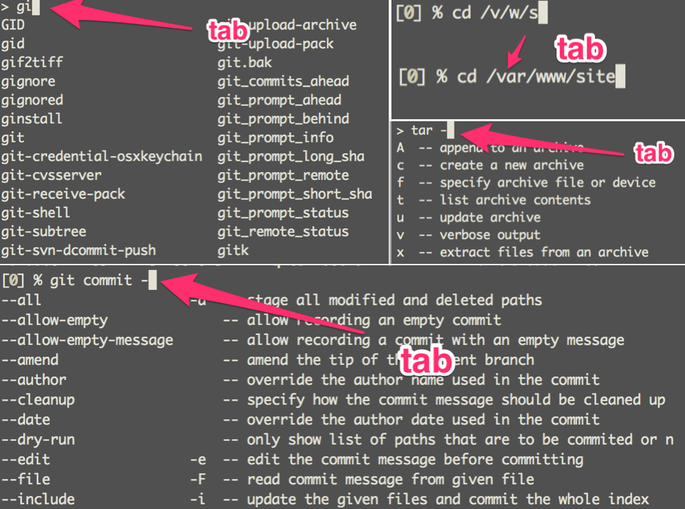
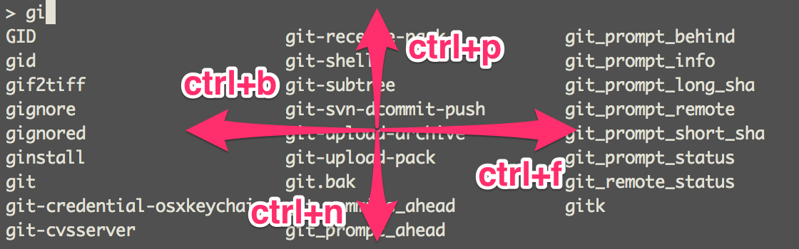
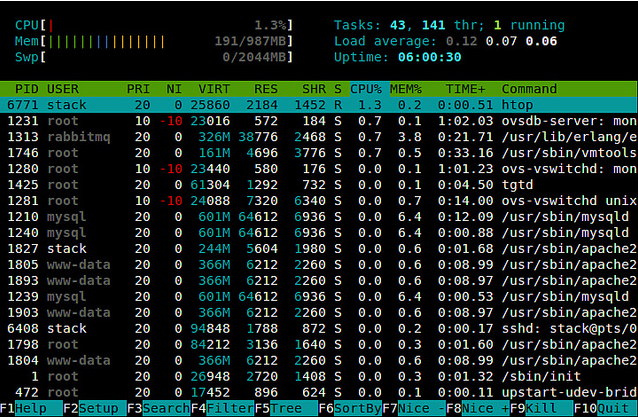
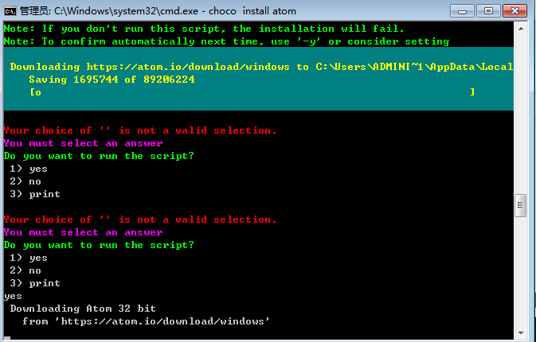
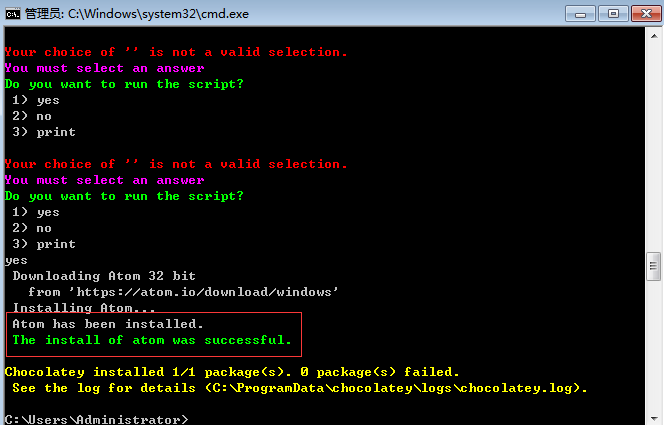

### Win 下必备神器Oh-my-zsh


####1. 优势
>`Babun`集成了`Cygwin`与`oh-my-zsh`，可用`Babun`统一不同的开发环境，`Zsh` 也许是目前最好用的 `bash` 工具。
> 下载地址:[http://babun.github.io][1]

####2. 安装

- 解压缩到任意文件夹后，运行install.bat（需管理员权限）
- 也可用`/t "D:\target_folder"`的模式指定安装目录
- 安装默认目录：`%USER_HOME%\.babun\cygwin\home`

####3. 配置及`oh-my-zsh`特性
#####3.1.`Babun`配置
>- `babun check` 判断环境是否正确
>- `babun update` 是否有新更新包
>- `pact` 系统自带的包管理工具

#####3.2.`oh-my-zsh`特性
```
         __                                     __
  ____  / /_     ____ ___  __  __   ____  _____/ /_
 / __ \/ __ \   / __ `__ \/ / / /  /_  / / ___/ __ \
/ /_/ / / / /  / / / / / / /_/ /    / /_(__  ) / / /
\____/_/ /_/  /_/ /_/ /_/\__, /    /___/____/_/ /_/
                        /____/
```
>- 自动安装：先`chsh -l`检查是否有`zsh`，若无执行`sudo apt-get | yum install zsh `，然后执行`sh -c "$(wget https://raw.github.com/robbyrussell/oh-my-zsh/master/tools/install.sh -O -)"`或`sh -c "$(curl -fsSL https://raw.github.com/robbyrussell/oh-my-zsh/master/tools/install.sh)"`即可安装`oh-my-zsh`
>- 手动安装：
>>`git clone git://github.com/robbyrussell/oh-my-zsh.git ~/.oh-my-zsh`
>>`cp ~/.oh-my-zsh/templates/zshrc.zsh-template ~/.zshrc`

>- `Zsh`内置了大量主题，可在`~/.oh-my-zsh/themes`中查看具体的配置。官网提供了一些主题的[截图][2]，推荐用[prose主题][3]。
>- 以前杀进程是`ps aux | grep xxx`查进程的 PID，然后`kill PID`。有了 `zsh`，直接kill xxx然后按下 tab 键即可，如`kill java # 按下 tab，变成：kill 9997`
>- `Zsh` 不仅支持普通 alias，还支持针对文件类型的 alias，具体参照[.zshrc样例][4]
>- 跳转更为智能，输入`d`，将列出当前 session 访问过的所有目录，再按提示的数字即可进入相应目录，可直接输入`..`代替`cd ..`，而`...`代替`cd ../..`
>- 历史记录，`Zsh` 的历史记录跨 session，可以共享，历史记录支持受限查找。如输入git，再按向上箭头，会搜索用过的所有 git 命令
>- `Babun`默认自动装`oh-my-zsh`，若无执行`sh -c "$(wget https://raw.github.com/robbyrussell/oh-my-zsh/master/tools/install.sh -O -)"`即可，然后`source .zshrc`，切换`bash shell`执行`chsh -s /bin/zsh`或`sudo usermod -s /bin/zsh web`即改变`web`用户的`Bash`
>- `Zsh`命令的提示更为强大


>- `Zsh` 指令搜索提示



#### 4.插件
> 常用插件：`z zsh_reload zsh-syntax-highligting git git-flow pip npm ...`
#####4.1. zsh-syntax-highlighting
```bash
cd ~/.oh-my-zsh/custom/plugins
git clone git://github.com/zsh-users/zsh-syntax-highlighting.git
plugins=( [plugins...] zsh-syntax-highlighting)
source ~/.zshrc or src
```
#####4.2. git-flow

```bash
curl -OL https://raw.github.com/nvie/gitflow/develop/contrib/gitflow-installer.sh
$ chmod +x gitflow-installer.sh
$ sudo ./gitflow-installer.sh
```
#####4.3. **z** 与 **autojump**
> `z` 是`oh-my-zsh`的一个插件目录位于`.oh-my-zsh/custom/plugin`，修改`.zshrc`的`plugin`添加`z`即可启用，与`autojump`类似，[Plugin:autojump][5]
> `autojump`可以直接在`.zshrc`文件中的`plugin`启用，若无此插件，执行`git clone git://github.com/joelthelion/autojump.git`，解压缩后进入目录，执行`./install.py`最后把以下代码加入`.zshrc`：
```
[[ -s ~/.autojump/etc/profile.d/autojump.sh ]] && . ~/.autojump/etc/profile.d/autojump.sh
```

#####4.4. **git**
>精简 git 命令，减少输入字符数。参见 [Plugin:git][6]

#####4.5. pip
>`Cygwin`自带的python没有pip，需手动下载：`wget https://bootstrap.pypa.io/get-pip.py -O - | python`

#####4.6. [**httpie**][7]
>HTTPie （读aych-tee-tee-pie）是一个 HTTP 的命令行客户端。其目标是让 CLI 和 web 服务之间的交互尽可能的人性化，执行`pip install --upgrade httpie`即可

#####4.7. [**icdiff**][8]
> 一个能并列高亮显示文件比较结果的小工具`icdiff`，可以与`git`配合使用

#####4.8. [**htop**][10]
>  `htop` 是一款运行于 Linux 系统监控与进程管理软件，用于取代 Unix 下传统的 `top`。与 `top` 只提供最消耗资源的进程列表不同，`htop` 提供所有进程的列表，并且使用彩色标识出处理器、swap 和内存状态

>  - 32-BIT
```bash
wget http://pkgs.repoforge.org/rpmforge-release/rpmforge-release-0.5.3-1.el6.rf.i686.rpm
rpm -Uhv rpmforge-release*.rf.i386.rpm
```
>  - 64-BIT
```bash
wget http://pkgs.repoforge.org/rpmforge-release/rpmforge-release-0.5.3-1.el6.rf.x86_64.rpm
rpm -Uhv rpmforge-release*.rf.x86_64.rpm
```

>Install htop on CentOS with yum

>> $  sudo yum install htop #Install htop

>Compile htop from the Source on CentOS

```
$ sudo yum groupinstall "Development Tools"
$ sudo yum install ncurses-devel
$ wget http://hisham.hm/htop/releases/1.0.3/htop-1.0.3.tar.gz
$ tar xvfvz htop-1.0.3.tar.gz
$ cd htop-1.0.3
$ ./configure
$ ./configure --prefix=/usr
$ make && sudo make install
```

>$ htop



>`htop` 命令优点

>>快速查看关键性能统计数据，如 CPU（多核布局）、内存/交换使用
>>可以横向或纵向滚动浏览进程列表，以查看所有的进程和完整的命令行
>> 杀掉进程时可以直接选择而不需要输入进程号
>>通过鼠标操作条目
>> 比 top 启动得更快


#####4.9. [**ccat**][11]
>`ccat` 是上色的cat，在 cat 的基础上提供了语法高亮。目前已支持ruby, python, javascript, java, c, go

#####4.10. [**ag**][12]
>`ag` 是一个新的搜索工具：
>>与ack相比，速度有了巨大的提升，这里有一个对比
>> 搜索会忽略.gitignore和.hgignore中的 pattern
>> 不想搜索的文件可以把对应的 pattern 写到.agignore中
>> 命令比ack短 33%，且一只手可以按全

```bash
$ sudo rpm -Uvh http://download.fedoraproject.org/pub/epel/7/x86_64/e/epel-release-7-5.noarch.rpm
$ sudo yum install the_silver_searcher
```

#####4.11. [**ConEmu**][13]
>`ConEmu` 是一个带标签的Windows终端，提供多标签支持和丰富的自定义选项，是Windows下不可多得的Console，将`Babun`加入到`ConEmu`：
>- In ConEmu
>- Go to Settings>Startup>Tasks
> Create a new task
>- Task parameters： `/icon "%userprofile%\.babun\cygwin\bin\mintty.exe" /dir "%userprofile%"`
>- Commands： `%userprofile%\.babun\cygwin\bin\mintty.exe -`

>**[Clink][14]** - Powerful Bash-style command line editing for cmd.exe
>`Clink`可以提高用户在 Microsoft Windows 的 "cmd.exe" 中的工作效率,让 `cmd` 像 Linux 终端一样容易使用。

>`Clink`快捷键
- 从剪贴板粘贴 (Ctrl-V).
- 增量搜索历史 (Ctrl-R/Ctrl-S).
- 代码提示 (TAB).
- 恢复 (Ctrl-Z).
- 自动 “cd ..” (Ctrl-Alt-U).
- 环境变量扩展(Ctrl-Alt-E).
- 帮助信息(Alt-H)


#####4.12. [**Cmder**][15]

> `Cmder`作为一个压缩档的存在, 可即压即用，甚至可以放到USB就可以虽时带着走，连调整过的设定都会放在这个目录下，不会用到系统机码(Registry)，也很适合放在Dropbox / Google Drive / OneDrive共享于多台电脑。
> 下载的时候，有两个版本，分别是mini与full版；唯一的差别在于有没有内建msysgit工具，这是Git for Windows的标准配备；全安装版 cmder 自带了 msysgit, 压缩包 23M, 除了 git 本身这个命令之外, 里面可以使用大量的 linux 命令；比如 grep, curl(没有 wget)； 像vim, grep, tar, unzip, ssh, ls, bash, perl 对于爱折腾的Coder更是痛点需求。
> 借用Win下的神器`AutoHotKey`配置`Alt+r`快捷键启动`Cmder`如下

```
!r:: run, D:\soft\cmder\Cmder.exe
```

>设置`Babun`为默认的开启选项
>> 1. `Win + Alt + P`打开配置页面
>> 2. 找到`Startup`的`Tasks`，新增`tasks`，命名为`babun`，在`Task parameters`输入`/icon "D:\babun\.babun\cygwin\bin\mintty.exe" /dir "D:\babun"`，在`Start console`一栏下输入`D:\babun\.babun\cygwin\bin\mintty.exe -`保存即可。

>解决文字重叠问题
>> 1. `Win + Alt + P`打开配置页面
>> 2. 找到`Main`的`font`，去掉`monospace`即可


>修改默认的命令符提示符`λ`
>> 编辑Cmder安装目录下的vendor\init.bat批处理文件(min版本15行)，把：

```
@prompt $E[1;32;40m$P$S{git}{hg}$S$_$E[1;30;40m {lamb} $S$E[0m
```

修改成以下即可：

```
@prompt $E[1;32;40m$P$S{git}{hg}$S$_$E[1;30;40m $$ $S$E[0m
```

>快捷键
- 自动补全 (Tab).
- 新页签 (Ctrl-T).
- 关闭页签 (Ctrl-W).
- 切换页签 (Ctrl-Tab).
- 快速切换到第n个页签 (Ctrl-n).
- 全屏状态 (Alt-Enter).
- 历史命令搜索 (Ctrl-r).
- 自动 “cd ..” (Ctrl-Alt-U).
- 环境变量扩展(Ctrl-Alt-E).
- 帮助信息(Alt-H)

>`Cmder`元件组成
>>`Cmder`其实结合了多套软体，其中包括 `msysgit` 与最重要的 `ConEmu` 与 `Clink` 软体，而`ConEmu`与`Clink`这两套软体就是`Cmder`真正的核心元件。
>>`msysgit` 除了提供Git for Windows 相关工具外，其实还提供了多套Unix/Linux 环境下常用的指令列工具，例如less, ls, tar, unzip, md5sum, grep, sed, … 等多套工具。 
>>一个grep 就不知道比Windows 内建的findstr 强


>自定义`aliases`
>>打开Cmder目录下的config文件夹，里面的`aliases`文件就是我们可以配置的别名文件，如下：

```
e.=explorer .
gcc=cd D:\Document\gcc\
gw=cd D:\Document\GitHub\work
gl=git log --oneline --all --graph --decorate  $*
ls=ls --show-control-chars --color=auto $*
pwd=cd
clear=cls
```

#####4.13. [**Chocolatey**][16]软件包管理系统

>在 Linux 下，大家喜欢用 apt-get(mac下用brew) 来安装应用程序，如今在 windows 下，大家可以使用  `Chocolatey`来快速下载搭建一个开发环境。 `Chocolatey`的哲学就是完全用命令行来安装应用程序， 它更像一个包管理工具（背后使用 Nuget ）。
>另外需要说明的是， Chocolatey 只是把官方下载路径封装到了 Chocolatey 中，所以下载源都是其官方路径，所以下载的一定是合法的，但是如果原软件是需要 Licence 注册的话，那么 Chocolatey 下载安装好的软件还是需要你去购买注册。不过 Chocolatey 一般还是会选用免费 Licence 可用的软件。
>安装chocolatey , 运行如下命令即可：

```
powershell -NoProfile -ExecutionPolicy unrestricted -Command "iex ((new-object net.webclient).DownloadString('https://chocolatey.org/install.ps1'))" && SET PATH=%PATH%;%ALLUSERSPROFILE%\chocolatey\bin
```



>出现如下提示表示`Chocolatey`安装成功：



>安装软件命令 `choco install softwareName,` 短写是 `cinst softwareName`
>可安装的应用程序，可以参见其 Package列表，以下是window下开发常用的开发环境应用:

```

choco install autohotkey.portable    #安装 AutoHotkey (Portable)
choco install nodejs.install  #安装 node
choco install git.install     #安装 git
choco install ruby            #安装 ruby
choco install python          #安装 python
choco install jdk8            #安装 JDK8
choco install googlechrome    #安装 Chrome
choco install google-chrome-x64 #Google Chrome (64-bit only) 
choco install firefox         #安装 firefox
choco install notepadplusplus.install #安装 notepad++
choco install Atom                    #安装 Atom
choco install SublimeText3            #安装 SublimeText3
```


  [1]: http://babun.github.io/
  [2]: https://github.com/robbyrussell/oh-my-zsh/wiki/themes
  [3]: https://github.com/wenzhucjy/my_files/blob/master/oh-my-zsh/prose.zsh-theme
  [4]: https://github.com/wenzhucjy/my_files/blob/master/oh-my-zsh/.zshrc
  [5]: https://github.com/wting/autojump
  [6]: https://github.com/robbyrussell/oh-my-zsh/wiki/Plugin:git
  [7]: https://github.com/jakubroztocil/httpie
  [8]: https://github.com/jeffkaufman/icdiff
  [9]: https://github.com/chrisallenlane/cheat
  [10]: http://hisham.hm/htop/
  [11]: https://github.com/jingweno/ccat
  [12]: https://github.com/ggreer/the_silver_searcher
  [13]: https://conemu.github.io/
  [14]: http://mridgers.github.io/clink/
  [15]: http://cmder.net/
  [16]: https://chocolatey.org/