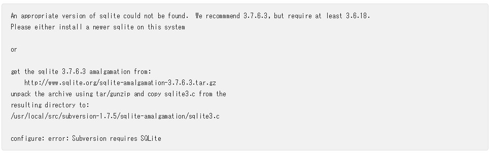

###How to install Subversion in Linux

>官网地址:https://svn.apache.org/repos/asf/subversion/trunk/INSTALL

####1.Lets check which version we have now

>- svn --version

####2.Got the recomended download section
>wget http://archive.apache.org/dist/subversion/subversion-1.7.5.tar.gz

>tar  zxf subversion-1.7.5.tar.gz 

>mv subversion-1.7.5   /usr/local/src

>cd  /usr/local/src/subversion-1.7.5

####3.Install apr,apr-util packages

>wget http://rahulsoni.me/files/apr-util-1.3.12.tar.gz

>wget http://rahulsoni.me/files/apr-1.4.5.tar.gz

>tar zxf apr-util-1.3.12.tar.gz

>mv apr-util-1.3.12 apr-util   `# When using ./configure it will look for these files by default on a folder without version number`

> tar zxf apr-1.4.5.tar.gz

> mv apr-1.4.5 apr `# When using ./configure it will look for these files by default on a folder without version number`

####4. Configure、make、make install 

>./configure --without-berkeley-db --without-apxs --without-swig --without-serf --with-ssl
>过程中若提示：



>需用`sqlite-amalgamation`来修复，具体命令如下：
> wget http://www.sqlite.org/sqlite-amalgamation-3071300.zip

> unzip sqlite-amalgamation-3071300.zip

> mv sqlite-amalgamation-3071300 subversion-1.7.5/sqlite-amalgamation


- Now that we have the updated sqlite, lets continue with the subversion install:

> ./configure --without-berkeley-db --without-apxs --without-swig --without-serf --with-ssl

> make

> sudo make install

####5. Check subversion version
>- svn --version

```
svn, version 1.7.5 (r1336830)
   compiled Nov 19 2015, 19:28:46

Copyright (C) 2012 The Apache Software Foundation.
This software consists of contributions made by many people; see the NOTICE
file for more information.
Subversion is open source software, see http://subversion.apache.org/

The following repository access (RA) modules are available:
* ra_svn : Module for accessing a repository using the svn network protocol.
  - handles 'svn' scheme
* ra_local : Module for accessing a repository on local disk.
  - handles 'file' scheme
```
>`ra_svn`和`ra_local`是`subversion`的档案库，`ra_svn`：使用svn网络协议访问档案库的模块；`ra_local`：访问本地磁盘的档案库模块，但若直接`svn export 'https://url'`，还需加载`neon`插件，引入 `ra_neon`模块，否则会出现` svn: E170000: Unrecognized URL scheme for 'https://ip/svn/dest'`


####6. Add ra_neon to svn

>wget http://www.webdav.org/neon/neon-0.29.6.tar.gz

>tar -zxf neon-0.29.6.tar.gz

>mv neon-0.29.6 neon

>cd neon 

>./configure --with-ssl=openssl

>>若`configure`过程中遇到`configure: error: no XML parser was found:  libxml 2.x required`，还需额外加载`expat`依赖插件，方法如下：
>> http://sourceforge.net/projects/expat/files/expat-2.0.1.tar.gz
>>tar zxvf expat-2.0.1.tar.gz  
>>cd expat-2.0.1  
>>./configure  
>>make  
>>make install  

>执行成功后，重新`configure --with-ssl=openssl`neon插件，然后`make && sudo make install`

>需注意：要让`svn`加载`neon`插件，先`sudo rm /usr/local/svn`，而后重新`Configure` subversion，如下指令：
>>./configure --without-berkeley-db --without-apxs --without-swig --without-serf --with-ssl --with-neon
>>重新`make && sudo make install`即可，若返回成功则`svn`就已经成功加载`ra_neno`插件，检测`ra_neon`插件是否加载成功：

```
svn, version 1.7.5 (r1336830)
   compiled Nov 19 2015, 19:28:46

Copyright (C) 2012 The Apache Software Foundation.
This software consists of contributions made by many people; see the NOTICE
file for more information.
Subversion is open source software, see http://subversion.apache.org/

The following repository access (RA) modules are available:

* ra_neon : Module for accessing a repository via WebDAV protocol using Neon.
  - handles 'http' scheme
  - handles 'https' scheme
* ra_svn : Module for accessing a repository using the svn network protocol.
  - handles 'svn' scheme
* ra_local : Module for accessing a repository on local disk.
  - handles 'file' scheme

```


####7. Go to all of your local working directories and do a svn upgrade:
>更新svn项目
>>svn upgrade

>导出svn项目
>>svn export https://xxxx/svn/svn_path svn_temp --user name xxx --password xxx --force


