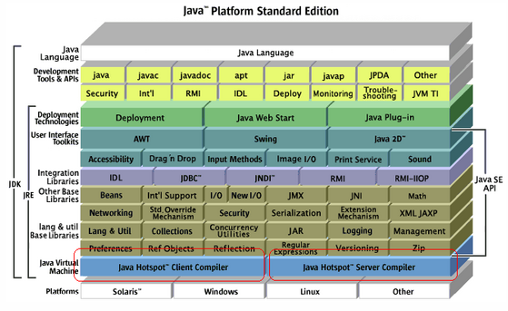
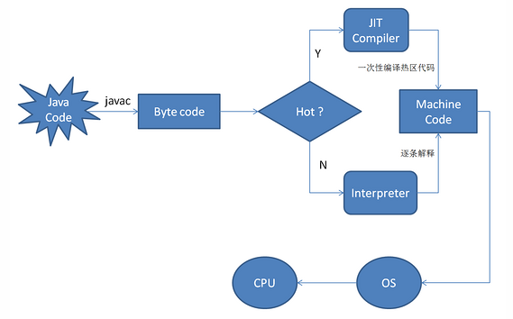
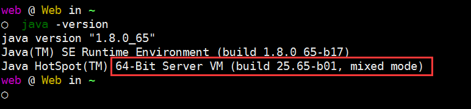

### JVM的类型和模式



#### JVM类型

> `Client JVM`适合需要快速启动和较小内存空间的应用，它适合交互性的应用，比如GUI；而`Server JVM`则是看重执行效率的应用的最佳选择。不同之处包括：编译策略、默认堆大小、内嵌策略

> 初始化参数比较

```
java -XX:+PrintFlagsFinal -version 2>&1 | grep -i -E 'heapsize|permsize|version'

java -client -XX:+PrintFlagsFinal -version 2>&1 | grep -i -E 'heapsize|permsize|version'
```

>`$JAVA_HOME\jre\lib\amd64\jvm.cfg`文件定义了JVM类型(以`64-bit`为例)

```
#-server排第一位表示首选使用server模式的JVM
-server KNOWN
-client IGNORE
```

#### JIT编译

> JIT 工作原理



```
JIT编译器（即时编译器），当虚拟机发现某个方法或代码块运行特别频繁时，就会把这些代码认定为“Hot Spot Code”（热点代码），为了提高热点代码的执行效率，在运行时，虚拟机将会把这些代码编译成与本地平台相关的机器码，并进行各层次的优化，完成这项任务的正是JIT编译器
```

#### JVM的工作模式

>`java -version`



>其中`mixed mode`就说明当前JVM是工作在mixed模式下的

>执行`java -X`，查看JVM支持的工作模式

```
-Xmixed  混合模式执行(默认，会同时使用编译模式和解释模式，对于字节码中多次被调用的部分，JVM会将其编译成本地代码以提高执行效率；而 被调用很少（甚至只有一次）的方法在解释模式下会继续执行，从而减少编译和优化成本。 JIT编译器在运行时创建方法使用文件，然后一步一步的优化每一个方法，有时候会主动的优化应用的行为)

-Xint    仅解释模式执行(会强制JVM以解释方式执行所有的字节码)

-Xcomp   编译方式执行(JVM在第一次使用时会把 所有的字节码编译成本地代码 ，从而带来最大程度的优化，然而，很多应用在使用-Xcomp也会有一些性能损失，但是这比使用-Xint损失的少，原因是-Xcomp没有让JVM启用JIT编译器的全部功能)
```

>获取JVM的工作模式

```
System.out.println(System.getProperty("java.vm.name")); //获取JVM名字和类型
System.out.println(System.getProperty("java.vm.info")); //获取JVM的工作模式
```
