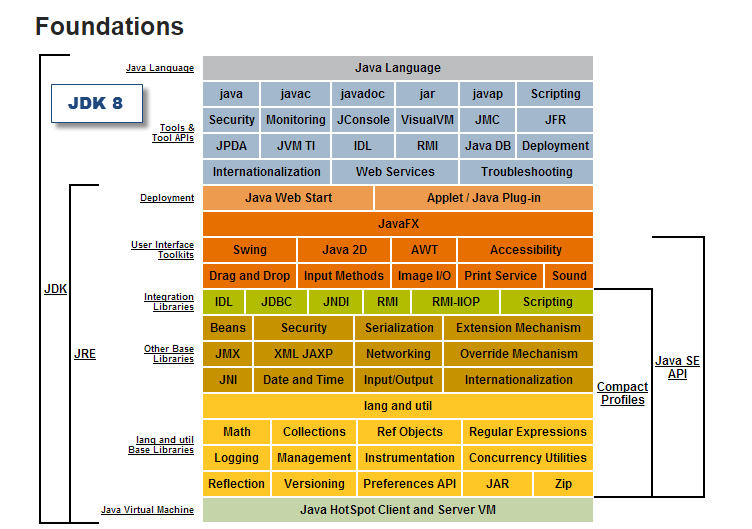
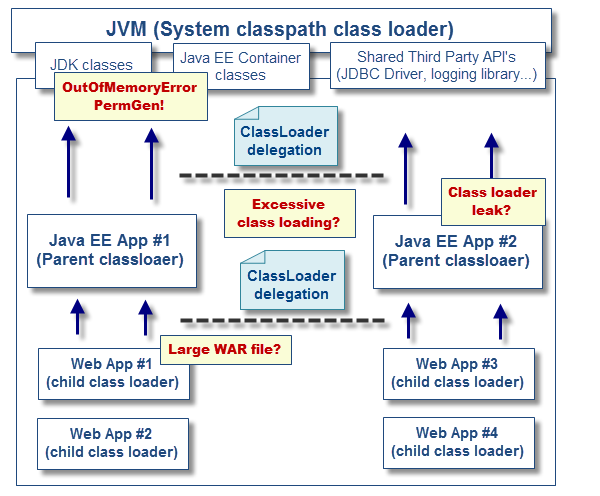
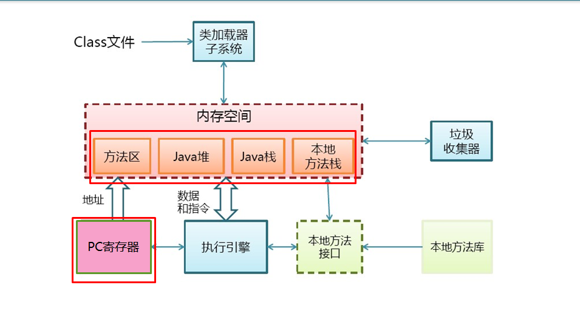
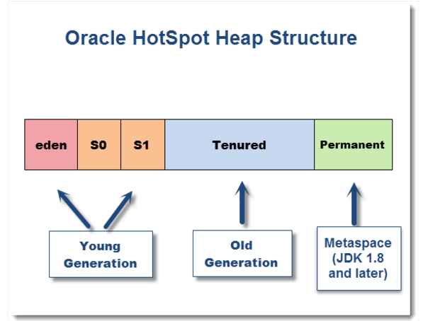
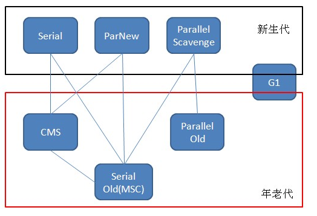

### JVM的调优

>Java 技术体系所包含的内容




>JVM ClassLoader



#### 0. JVM的核心组成部分

- Class Loader
- 执行引擎


#### 1. JVM 数据类型
  1. 基本类型
    `byte`,`short`,`int`,`long`,`char`,`float`,`double`,`boolean`
  2. 引用类型
    类类型(对象)，接口类型和数组(连续存储)

#### 2. JVM 运行时数据区域

##### 2.1. JVM 运行时数据区域



| 数据区域     | 线程     |
| :------------- | :------------- |
| PC寄存器      | 私有，线程独占的内存空间      |
| Java虚拟机栈      | 私有，存放线程自己的局部变量等      |
| 本地方法栈      | 私有      |
| Java堆      | 公有，jvm所管理的内存最大一部分，GC管理主要区域，分代收集算法      |
| 方法区      | 私有，线程共享，用于存储被虚拟机加载的类信息、常量、静态变量等      |

##### 2.2. 虚拟机栈

Java虚拟机栈(Virtual Machine Stacks)是线程私有的，它的生命周期与线程相同，描述的是Java方法执行的内存模型：每个方法执行的同时会创建一个栈帧用于存储局部变量、中间计算过程和数据的运行状态、方法的返回值等信息。代表处理逻辑，是运行时的单位，数据结构是先进后出，存的是基本数据类型(因基本数据类型长度固定，参数传递按值传递指的是基本数据类型而若按引用传递指的是对象)和堆中对象的引用。退出方法的时候，修改栈顶指针就可以把栈帧中的内容销毁，而堆是存储的单位，只负责存储对象信息，栈和堆根据堆中对象的引用指针关联起来

指定-Xss128k 控制栈大小，当栈中存储数据比较多时，需要适当调大这个参数，否则会出现`Java.lang.StackOverflowError`异常，-Xss 在堆之外，线程占用栈内存，默认每条线程为1M（以前是256K）。除了方法调用出参入参的栈，逃逸分析后也会把只在该线程里可见的对象直接分配在线程栈里，而不是公共的Heap里，也就减少了新生代的GC频率

##### 2.3. 堆

Java 堆(Heap)是所有线程共享的一块内存区域，在虚拟机启动时创建，几乎所有的对象实例以及数组都要在堆上分配。大多数内存对象生存周期比较短(如RPC请求的buffer)，也有的生存周期比较长(如Block Cache中的热点Block)。现在收集器基本都采用分代收集算法，在HotSpot VM中物理内存空间被划分为两部分：新生代(young generate)[Eden空间、From Survivor 空间、To Survivor 空间等]和年老代(old generation)

> 堆配置参数:

>> -Xms 初始堆大小，默认物理内存的1/64(<1GB)

>> -Xmx 最大堆大小，默认物理内存的1/4(<1GB)，实际上建议不大于4GB

>> 一般建议设置 -Xms = -Xmx，避免每次在GC后，调整堆的大小，减少系统内存的分配开销

>> 整个堆大小 = 年轻代大小 + 年老代大小 + 持久代大小


> 堆存储空间结构



HotSpot Java Virtual Machine是由以下的存储空间组成

| 存储空间    |描述     |
| :------------- | :------------- |
| Java Heap      | Java程序类实例和数组的主存储器      |
|Permanent Generation(1.7 or lesser) Metaspace (1.8 or later)|Java类元数据的主存储器，`从Java 8开始PermGen空间就由元空间和使用本地存储器替换了，类似于IBM J9 JVM`|
|Native Heap(C-Heap)	|本地内存存储线程、栈、包括对象的代码缓存，如MMAP文件和第三方本机库|

> 栈和堆内存分配对比

| 条目     | 缺点 |优点|变量|
| :------- | :------ |:-----|:---|
| 栈内存分配      | 存在栈中的数据大小、生存期是在编译时确定的，导致其缺乏灵活性| 存取速度比堆快，仅次于寄存器、栈数据可以共享|-Xss|
|堆内存分配|运行时动态分配内存，在分配和销毁时都要占用时间，因此堆的效率较低|动态的分配内存大小，生存期不必事先告诉编译器，它是在运行期动态分配的，垃圾回收器会自动收走不再使用的空间区域|-Xms,-Xmm|


###### 2.3.1 新生代(young generation)

大多数新生对象及引用对象都被分配在`Eden`区，第一次GC过后`Eden`中还存活的对象被移到其中一个`Survivor`区，再次GC过程中，`Eden`中还存活的对象会被移到之前已移入对象的`Survivor`区，一旦该`Survivor`区域无空间可用时，还存活的对象会从当前`Survivor`区移到另一个空的`Survivor`区。而当前`Survivor`区就会再次置为空状态，经过数次在两个`Survivor`区域移动后还存活的对象最后会被移动到年老代。而对象从新生代移除时，称之为`Minor GC`，YG space的尺寸和GC频率过高将会显著影响程序的响应时间，从而导致JVM的暂停时间增加

>- 新生代 = 1个eden区 + 2个Survivor区(S0+S1)

>- -Xmn 年轻代大小(1.4or later)，-XX:NewSize. -XX:MaxNewSize(设置年轻代开销[for 1.3/1.4])，默认值大小为整个堆的3/8

>- -XX:NewRatio=<number>，年轻代包括Eden一个和Survivor两个与年老代比值(除去持久代)，当Xms=Xmx 并设置了Xmn的情况下，该参数不需要进行设置，调优过程改变-XX:NewRatio对性能会有显著的影响

>- -XX: SurvivorRatio=<number>，Eden区与Surivivor的大小比值，设置为8，则两个Survivor区与一个Eden区比值2:8，一个Survivor区占整个年轻代的1/10，-XX:SurvivorRatio 新生代中每个存活区的大小，默认为8，即1/10的新生代 1/(SurvivorRatio+2)，设小点省点给新生代，但要避免太小使得存活区放不下临时对象而要晋升到年老代，还是从GC Log里看实际情况了


###### 2.3.2 年老代(Old generation)

存活在新生代中但未变为不可达的对象会被复制到年老代。一般来说年老代的内存空间比新生代大，所以在年老代GC发生的频率较新生代低一些。当对象从年老代被移除时，我们称之为`Major GC`(或者`Full GC`)

>- 年老代 = 整个堆 - 年轻代大小 - 持久代大小(for 1.7 or lesser)

>- 年轻代中经过垃圾回收没有回收掉的对象被复制到年老代

>- 年老代存储对象比年轻代年龄大的多，而且不乏大对象

>- 新建的对象也有可能直接进入年老代，可通过启动参数设置 `-XX:PretenureSizeThreshold=1024`(单位为字节，默认为0，即所有对象都进`Eden`区)来代表超过多大时就不在新生代分配，而是直接在年老代分配，`建议不配置`，年老代也接收大的数组对象(连续存储)，且数组中无引用外部对象

>- 年老代大小无配置参数

Minor GC 与 Major GC/Full GC 区别：

> 1. 新生代GC(Minor GC): 指发生在新生代的垃圾收集动作，因为Java对象大多都具备朝生夕灭的特性，所以Minor GC非常频繁，一般回收速度也比较快

>2. 年老代GC(Major GC/Full GC):对整个堆进行整理，包括 Young/Old/Perm，包括指发生在年老代的GC，出现了 Major GC，经常会伴随至少一次的Minor GC(但非绝对的，在 Parallel Scavenge 收集器的收集策略就有直接进行 Major GC 的策略选择过程)，Major GC 的速度一般会比 Minor GC 慢10倍以上，导致 Full GC的情况

```
年老代(Old)被写满
持久代(Perm)被写满
System.gc()被显示调用
上一次GC之后Heap的各域分配策略动态变化

```

##### 2.4. 方法区

方法区(Method Area)与堆一样，是各个线程共享的内存区域，存储已被虚拟机加载的类信息、常量、静态变量、即时编译器编译后的代码等数据，方法区跟永久代并不等价，使用永久代来实现方法区而已。JDK 7 的HotSpot已经把原本放在永久代的字符串常量池移出， JDK 8 中永久代向元空间的转换的原因：

>> 1、字符串存在永久代中，容易出现性能问题和内存溢出

>> 2、类及方法的信息等比较难确定其大小，因此对于永久代的大小的指定比较困难，太小容易出现永久代溢出，太大，容易导致年老代溢出

>> 3、永久代会为 GC 带来不必要的复杂度，并且回收效率偏低

>> 4、Oracle 可能会将HotSpot 与 JRockit 合二为一

JDK8 里的metaspace，是为了取代永久代实现方法区所规定的功能，元空间与永久代最大的区别在于，元空间并不在虚拟机中，而是使用的本地内存。默认情况下，元空间的大小仅受本地内存的限制，可以通过下面的选项来指定元空间的大小：

```
-XX:MetaspaceSize，初始空间大小，达到该值就会触发垃圾收集进行类型卸载，同时GC会对该值进行调整：如果释放了大量的空间，就适当的降低该值；如果释放了很少的空间，那么在不超过MaxMetaspaceSize时，适当的提高该值。-XX:MaxMetaspaceSize，最大空间，默认是没有限制的。
除了上面两个指定大小的选项以外，还有两个与 GC 相关的属性：
-XX:MinMetaspaceFreeRatio，在GC之后，最小的Metaspace剩余空间容量的百分比，减少为分配空间导致的垃圾收集
-XX:MaxMetaspaceFreeRatio，在GC之后，最大的Metaspace剩余空间容量的百分比，减少为释放空间导致的垃圾收集，设置触发metaspace回收的阈值每个类加载器都会从全局的metaspace空间里取一些metaChunk管理起来，当有类定义的时候，其实就是从这些内存里分配的，当不够的时候再去全局的metaspace里分配一块并管理起来

```

> JDK8 移除永久代，即类的元数据、字符串池、类的静态变量将会从永久代移除，放入Java heap 或 native memory，其中建议JVM的实现中将类的元数据放入 native memory ，将 字符串池和类的静态变量放入Java 堆中，这样加载多少类的元数据由系统的实际可用空间来控制


###### 2.4.1 持久代(perm generation) for JDK7 or lesser

>- 持久代 = 整个堆 - 年轻代大小 - 年老代大小

>- -XX:PermSize -XX:MaxPermSize，设置持久代代销，一般情况推荐把-XX:PermSize设置成XX:MaxPermSize的值为相同的值，因为永久代大小的跳转也会导致堆内存需要出发fgc

>- 存放Class、Method元信息，其大小于项目的规模、类、方法的数量有关，一般设置为128M，设置原则预留30%的空间

>- 永久代的回收方式：

>> 常量池中的常量，无用的类信息，常量的回收很简单，没有引用就可以被回收；

>> 对于无用的类进行回收，必须保证3点：类的所有实例已经被回收；加载类的ClassLoader已经被回收；类对象的Class对象没有被引用(即没有通过反射引用该类的地方)


###### 2.4.2 JDK 1.8 Metaspace指南

| 目标     | 建议     |
| :------------- | :------------- |
| 内存大小| 默认情况下，元空间内存空间是无界的，并使用可用于动态扩展的process或OS native memory。内存空间分成快并通过mmap被JVM进行存储。建议保持默认设置，以动态调整模式为出发点，将简化的尺寸与密切监测的应用程序元数据占有量相结合，从而进行更好的容量规划      |
|GC调整|新增一个JVM选项(-XX:MaxMetaspaceSize=)，限制分配给class metadata的本地内存。当面临物理资源（RAM）紧张或类似于内存泄露的情况时，建议将它作为一个保障机制|
|监控和故障排除 |对那种具有larger class metadata footprint或dynamic classloading的Java应用程序，建议通过新的JVM选项调整初始元空间大小 ：-XX:MetaspaceSize=，例如：1GB。这种调整方法将有助于避免包括class metadata在内的早期垃圾回收，尤其是在Java应用程序的 “warm-up”期|

#### 3. 垃圾收集器与内存分配策略

##### 3.1. 引用类型

| 类型     | 描述    |
| :------------- | :------------- |
| 强引用       | new出的对象，若引用不当会造成内存泄露，垃圾回收时需要严格判断当前对象是否被强引用，如果是强引用，则不会被垃圾回收      |
|软引用|软引用一般用于缓存使用，软引用在垃圾回收时，虚拟机会根据当前系统的剩余内存来决定是否对软引用进行回收，若虚拟机在发生`OutOfMemory`时，肯定是没有软引用存在的|
|弱引用|弱引用与软引用类似，唯一区别是垃圾回收时是一定会被回收掉的|
|...|...|

##### 3.2. 垃圾收集算法

> 垃圾收集算法用于判断对象是否存活的算法

| 名称     | 描述     |
| :------------- | :------------- |
| 引用计数算法(for 1.2)       |   每个对象有一个引用计数属性，新增一个引用时计数加1，引用释放时计数减1，计数为0时可以回收，此方法简单，但无法解决对象相互引用的问题，还有一个问题是如何解决精准计算       |
|根搜索算法|从GC Roots开始向下搜索，搜索所走过的路径称为引用链。当一个对象到GC Roots没有任何引用链相连时，则证明此对象是不可用的，不可达对象|

在Java语言中，GC Roots包括

> 虚拟机栈中引用的对象

> 方法区中类静态属性实体引用的对象

> 方法区中常量引用的对象

> 本地方法栈中JNI引用的对象

##### 3.3. 垃圾回收算法

| 名称     |  描述     |
| :------------- | :------------- |
| 复制算法(Coping)  | a.复制算法采用从根集合扫描，并将存活对象复制到一块新的，没有使用过的空间中，这种算法当控件存活的对象比较少时，极为高效，但是带来的成本是需要一块内存交换空间用于进行对象的移动；</br> b.此算法用于`新生代`内存回收，从E区回收到S0或者S1|
|标记清除算法(Mark-Sweep)|a.标记-清除算法采用根集合进行扫描，对存活的对象进行标记，标记完毕后，再扫描整个空间未被标记的对象，进行回收；</br> b.标记-清除算法不需要进行对象移动，进行仅对不存活的对象进行处理，在存活对象比较多的情况下极为高效，但由于标记-清除算法直接回收不存活对象，因此会造成内存碎片(不连续)，适用于`年老代`|
|标记整理算法(Mark-Compac)|a.标记-整理算法采用标记-清除算法一样的方法进行对象的标记，但在清除时不同，在回收不存活的对象占用空间后，会将所有的存活对象往左端空闲空间移动，并更新对应的指针；</br> b.标记-整理算法是在标记清除算法的基础上，又进行了对象移动，因此成本更高，但解决了内存碎片问题，适用于`年老代`|
|分代收集算法|商业虚拟机都采用“分代收集算法”，把Java堆分为新生代和年老代，然后根据各个年代特点采用最适合的收集算法|


##### 3.4. 垃圾收集器

> JVM 垃圾收集器



###### 3.4.1 新生代 Serial 串行回收器

>单线程

>>只开启一条GC线程进行垃圾回收，并且在垃圾回收过程中停止一切用户线程`Stop-The-World`，从而用户的请求或图形化界面会出现卡顿

>适合客户端client模式应用(另一种是server模式)

>>一般客户端应用所需内存较小，不会创建太多的对象，而且堆内存不大，因此垃圾回收时间比较短，即使在这段时间停止一切用户线程，用户也不会感受到明显的停顿，因此本垃圾收集器适合客户端应用

>简单高效

>>由于Serial收集器只有一条GC线程，因此避免了线程切换的开销，从而简单高效

>采用“复制”算法

>配置策略： -XX:+UseSerialGC 开启，XX:MaxTenuringThreshold设置对象复制的次数，默认值是15，如希望跟踪每次minor GC后新的存活周期的阈值，可在启动参数上增加：-XX:+PrintTenuringDistribution ，输出的信息中的：Desired survivor size 1048576 bytes, new threshold 7 (max 15) new threshold 7即标识新的存活周期的阈值为7这是GC里改动效果最明显的一个参数了；策略：新生代(串行复制) + 年老代(串行标记整理) 的收集器组合进行内存回收

###### 3.4.2 新生代 ParNew 并行回收器

并行回收器也是独占式的回收器，在收集过程中，应用程序会全部暂停，但由于并行回收器使用多线程进行垃圾回收，因此在并发能力比较强的CPU上，它产生的停顿时间要短于串行回收器，而在单CPU或者并发能力弱的系统中，并行回收器的效果不会比串行回收器好，由于多线程压力，它的实际表现很可能比串行回收器差

> -XX:+UseParNewGC 来开启或使用 -XX:+UseConcMarkSweepGC 开启CMS同时也开启ParNew收集器，策略：新生代(多线程并行复制)，年老代(单线程串行标记整理)

> 使用复制算法

> 并行的、独占式垃圾回收器


并行(Parallel)和并发(Concurrent)区别：
```
并行：指多条垃圾收集线程并行工作，但此时用户线程仍然处理等待状态`stop-the-world`
并发：指用户线程与垃圾收集线程同时执行(但不一定是并行的，可能会交替执行)，用户程序在继续运行，而垃圾收集程序运行在另一个CPU

```

###### 3.4.3 新生代 Parallel Scavenge 收集器

Parallel GC又被称为"高吞吐优先GC(throughput GC)"，关注达到一个可控制的CPU吞吐量，即运行用户代码的时间/总时间，比如：JVM运行100分钟，其中运行用户代码99分钟，垃圾收集1分钟，则吞吐量是99%，这种收集器最高效率的利用CPU，适合运行后台运算

> 吞吐量 = 运行用户代码时间 / (运行用户代码时间 + 垃圾收集时间)

> -XX:+UseParallelGC 开启，使用 Parallel Scavenge(并行复制) + Serial Old(串行标记整理) 收集组合回收垃圾，这也是在`Server`模式下的默认值

> 使用复制算法

>年老代暂停应用程序，与串行收集器一样，使用 -XX:+UseParallelOldGC 打开年老代并行垃圾回收(JDK 6)，-XX:ParallelGCThreads 限制垃圾收集的线程数，默认最好与CPU数量相当，可以使用-XX:MaxGCPauseMillis 和 -XX:GCTimeRatio 来调整GC的时间

```
-XX:MaxGCPauseMillis=毫秒:指定垃圾回收时的最长暂停时间，设置吞吐量大小，如果指定了此值，堆大小和垃圾回收相关参数会进行调整以达到指定值
-XX:GCTimeRatio : 吞吐量为垃圾回收时间与非垃圾回收时间的比值，公式为1/（1+N）。例如，-XX:GCTimeRatio=19时，表示5%的时间用于垃圾回收。默认情况为99，即1%的时间用于垃圾回收
-XX:+UseAdaptiveSizePolicy：开启这个参数，即无需设定新生代大小(-Xmn)、Eden和Surivivor区的比例(-XX:SurivivorRatio)、晋升年老代对象年龄(-XX:PretenureSizeThreshold)等细节参数了，虚拟机会根据当前系统的运行请情况收集性能监控信息，动态调整这些参数以提供最合适的停顿时间或最大吞吐量，而这种调节方式成为GC 自适应的调节策略(GC Ergonomics)，这也是 Parallel Scavenge 收集器 与 ParNew 收集器的一个重要区别

```

若新生代选择了 Parallel Scavenge 收集器，年老代除了 Serial Old(PS Mark-Sweep)收集器外别无选择，
`Parallel Scavenge没有使用原本HotSpot其它GC通用的GC框架，因此不能跟使用了那个框架的CMS搭配使用
`，而年老代 Serail Old 收集器在服务器应用性能上的“拖累”，使用了 Parallel Scavenge 收集器也未必能在整体应用上获得吞吐量最大化的效果，由于单线程的年老代收集中无法充分利用服务器多CPU的处理能力，若是多CPU和高硬件环境下，组合不一定有 ParNew + CMS 组合效果好

###### 3.4.4 年老代 Serial Old 回收器

Serial Old 是 Serial 收集器的年老代的版本，同样是一个单线程收集器，使用标记-整理算法，也是在`Client`模式下虚拟机使用。两种用途：

```
1. JDK1.5以及之前的版本中与Parallel Scavenge收集器配合使用
2. 作为CMS收集器的后备预案，在并发手机发生`Concurrent Mode Failure`时使用

```

> 策略：新生代采用串行复制算法，年老代采用串行标记-整理算法进行组合收集

###### 3.4.5 年老代 Parallel Old 回收器(for JDK6 or later)

Parallel Old 是 Parallel Scavenge 的年老代版本，使用多线程和标记-整理算法的并行、独占式的垃圾回收器

>-XX:+UseParalleOldGC，使用 Parallel Scavenge(并行多线程复制) + Parallel Old(并行多线程标记整理) 组合收集器进行收集


###### 3.4.6 年老代 CMS (并发标记清除)回收器

CMS(Concurrent Mark-Sweep)收集器关注尽可能地缩短垃圾收集时用户线程的停顿时间，是指用户线程与GC线程同时执行(不一定是并行，可能交替，但总体上是在同时执行)，不需要停顿用户线程(其实在CMS中用户线程还是需要停顿的，只是非常短，GC线程在另一个CPU上执行)，应用度最广泛，只能配合 ParNew或Serial收集器，采用两次短暂停来替代标记整理算法的长暂停，它的收集周期：  

```
初始标记(CMS-initial-mark) -> 并发标记(CMS-concurrent-mark) -> 重新标记(CMS-remark)-> 并发清除(CMS-concurrent-sweep) ->并发重设状态等待下次CMS的触发(CMS-concurrent-reset)

```

CMS收集器运行过程分为4个阶段：

> 初始标记(CMS initial mark) ： 值标记GC Roots能直接关联到的对象

> 并发标记(CMS concurrent mark) ： 进行GC Roots Tracing的过程

> 重新标记(CMS remark) ： 修正并发标记期间因用户程序继续运行而导致标记发生改变的那一部分对象的标记

> 并发清除(CMS concurrent sweep) ：

```
其中初始标记和重新标记两个阶段仍然需要暂停，整个过程中耗时最长的并发标记和并发清除过程中收集器都可以和用户线程一起工作
 1. 标记-清除算法
   同时它也是一个使用多线程并发回收的垃圾收集器
 2. -XX:ParallelCMSThreads
   手工设定CMS的线程数量，CMS默认启动的线程数是((ParallelGCThreads[CPU数量]+3)/4)
 3. -XX:+UseConcMarkSweepGC 开启，默认也会开启 -XX:+UseSerialGC
   使用 ParNew + CMS + Serial Old 的收集组合进行内存回收，要是CMS运行期间预留的内存无法满足程序需要，就会出现一次 "Concurrent Mode Failure"失败而导致Full GC(由于CMS并发清理阶段用户线程还在运行着，伴随程序运行自然就还会有新的垃圾不断产生，这部分垃圾出现在标记过程之后，CMS无法在当次收集中处理掉它们，只好留待下一次GC再清理掉，这部分垃圾称为"浮动垃圾"，而CMS无法处理浮动垃圾就可能出现"Concurrent Mode Failure")，这时虚拟机将启动后备预案：临时启动Serial Old 作为年老代的垃圾收集
 4. -XX:CMSInitiatingOccupancyFraction
   设置 CMS 收集器在年老代控件被使用多少后触发垃圾收集，默认68%，仅在CMS收集器时有效-XX:+CMSInitiatingOccupancyFraction=80，不可设置太高否则会导致大量"Concurrent Mode Failure"
 5. -XX:+UseCMSCompactAtFullCollection
   由于CMS收集器会产生碎片，设置CMS收集器在完成垃圾收集后是否要进行一次内存碎片的整理，默认值就是true，没必要显式设置，仅在CMS收集器时有效
 6. -XX:+CMSFullGCsBeforeCompaction
   设置CMS收集器在进行若干次收集后再进行一次内存碎片整理过程，在上一次CMS并发GC执行过后，到底还要再执行多少次full GC才会做压缩，默认是0，也就是在默认配置下每次CMS GC顶不住了而要转入full GC的时候都会做压缩，通常与UseCMSCompactAtFullCollection参数一起使用。只在System.gc()，年老代达到100%，年老代碎片过大无法分配空间给新晋升的大对象这些特殊情况里发生，所以设为每次都进行碎片整理是合适的。
   若把CMSFullGCsBeforeCompaction配置为10，就会每隔10次真正的full GC才做一次压缩（而不是每10次CMS并发GC就做一次压缩，目前VM里没有这样的参数）。这会使full GC更少做压缩，也就更容易使CMS的old gen受碎片化问题的困扰
 7. -XX:CMSInitiatingPermOccupancyFraction
   设置Perm Gen 使用达到多少比率时触发，默认92%，当永久区占用率达到这一百分比时，启动CMS回收，在CMS中清理永久代中的过期的Class而不等到Full GC，JDK7默认关闭而JDK8打开。比如有没有运行动态语言脚本如Groovy产生大量的临时类，它会增加CMS remark的暂停时间，所以如果新类加载并不频繁，这个参数还是不开的好
 8. -XX:+CMSClassUnloadingEnabled：允许对类元数据进行回收，相对于并行收集器，CMS收集器默认不会对永久代进行垃圾回收。如果希望对永久代进行垃圾回收，可用设置此标志
 9. -XX:+CMSParallelRemarkEnabled：降低标记停顿
 10. -verbosegc 如果使用了CMS回收算法，CMS相关信息也会紧接着提供出来，-verbosegc选项可以把每次GC发生时的信息都以log方式输出，所以很容易观察GC操作关后heap使用率的变化情况
 11. -XX:+CMSScavengeBeforeRemark，默认为关闭，在CMS remark前，先执行一次minor GC将新生代清掉，这样从年老代的对象引用到的新生代对象的个数就少了，停止全世界的CMS remark阶段就短一些。如果看到GC日志里remark阶段的时间超长，可以打开此项看看有没有效果，否则还是不要打开了，多了次GC
 12. -XX:+CMSConcurrentMTEnabled ：当该标志被启用时，并发的CMS阶段将以多线程执行(因此，多个GC线程会与所有的应用程序线程并行工作)。该标志已经默认开启，如果顺序执行更好，这取决于所使用的硬件，多线程执行可以通过-XX：-CMSConcurremntMTEnabled禁用。
 13. -XX:+CMSCompactWhenClearAllSoftRefs:默认是true
```

CMS GC要决定是否在full GC时做压缩，会依赖几个条件：

```
第一种条件，UseCMSCompactAtFullCollection 与 CMSFullGCsBeforeCompaction 是搭配使用的；前者目前默认就是true了，也就是关键在后者上
第二种条件是用户调用了System.gc()，而且DisableExplicitGC没有开启
第三种条件是young gen报告接下来如果做增量收集会失败；简单来说也就是young gen预计old gen没有足够空间来容纳下次young GC晋升的对象

```

上述三种条件的任意一种成立都会让CMS决定这次做full GC时要做压缩，还有一个参数，CMSCompactWhenClearAllSoftRefs，默认也是true


###### 3.4.7 G1收集器
G1(Garbage-First)收集器是当今收集器技术发展最前言成果之一，直至JDK-7u4版本才移除了"Experimental"标识，是一款面向服务器端应用的垃圾收集器
Serial/ParNew/Parallel Scavenge 回收器是针对新生代
CMS/Serial Old/Parallel Old 回收器是针对年老代


###### 3.4.8 其他参数

```
-server ：虚拟机工作在server模式
-XX:+UseFastAccessorMethods : 原始类型快速优化
-XX:+UseCompressedOops：64-bit 的 JVM指针会导致CPU缓存相比32-bit指针减少很多，所以建议采用指针压缩将64-bit指针压缩为32-bit，但却又能使用64-bit的内存空间，由于从32位到64位，Java应用程序对heap 的需求会比原来高1.5倍。所以，在Java 1.7及以下的版本(这是默认的)中使用 -XX:+UseCompressedOops是非常重要的，此参数调整大大减轻了64位JVM的性能压力，默认是打开的
-XX:AutoBoxCacheMax=20000：Integer i = 3;这语句有着 int自动装箱成Integer的过程，JDK默认只缓存 -128 ~ +127的int 和 long，超出范围的数字就要即时构建新的Integer对象。设为20000后，我们应用的QPS从48,000提升到50,000，足足4%的影响
-XX:+PerfDisableSharedMem ：用此参数可以禁止JVM写statistics数据，代价是VisualVM和jstat用不了，只能用JMX取数据，但在生产环境本来就不需要VisaulVM
-XX:MetaspaceSize=128m -XX:MaxMetaspaceSize=512m（JDK8），JDK8的永生代几乎可用完机器的所有内存，同样设一个128M的初始值，512M的最大值保护一下
-XX:MaxDirectMemorySize ，堆外内存/直接内存的大小，默认为Heap区总内存减去一个Survivor区的大小
-XX:ReservedCodeCacheSize ， JIT编译后二进制代码的存放区，满了之后就不再编译。JDK7默认不开多层编译48M，开了96M，而JDK8默认开多层编译256M。可以在JMX里看看CodeCache的大小，JDK7下的48M一般够了，若内存大也可以把它设大点
-XX:+PrintCommandLineFlags  运维有时会对启动参数做一些临时的更改，将每次启动的参数输出到stdout，将来有据可查。
打印出来的是命令行里设置了的参数以及因为这些参数隐式影响的参数，比如开了CMS后，-XX:+UseParNewGC也被自动打开
-XX:-OmitStackTraceInFastThrow  进制日志打印出异常StackTrace的信息，方便排查问题
-Xnoclassgc : 禁用垃圾回收
-XX:+HeapDumpOnOutOfMemoryError	 发生OutOfMemory时，输出内存状况， 用-XX:HeapDumpPath指定输出路径
-XX:HeapDumpPath=logs/memory.dump
-XX:OnOutOfMemoryError=$CATALINA_HOME/bin/stop.sh 或 -XX:OnOutOfMemoryError=$CATALINA_HOME/bin/restart.sh，OOM之后除了保留堆dump外，根据管理策略选择合适的运行脚本
```

###### 3.4.9 打印JVM执行时的参数

```
java -XX:+PrintFlagsFinal -version | tee jvm_param.out  # 打印JVM执行参数并输出到jvm_param.out文件中
java -XX:+UnlockDiagnosticVMOptions -XX:+UnlockExperimentalVMOptions -XX:+PrintFlagsFinal -version
```

###### 3.4.10 输出JNI编译信息

```
-XX:+PrintCompilation   输出JIT编译过的方法

# 输出JIT编译的细节信息
-XX:+LogCompilation
-XX:+UnlockDiagnosticVMOptions
-XX:+TraceClassLoading
-XX:+PrintAssembly

# 分层编译模式（tiered compilation）：这是自从Java SE 7以后的新特性，可通过添加启动参数来开启；在Java SE 8中，这个特性是默认的
-XX:+TieredCompilation
```


#### 4.  GC 性能指标及内存配置原则

##### 4.1. GC 性能指标

GC调优通常就是为了改善`stop-the-world`的时间

```
1. 吞吐量      应用花在非GC上的时间百分比
2. GC负荷     与吞吐量相反，指应用花在GC上的时间百分比
3. 暂停时间    应用花在GC Stop-The-World 的时间
4. GC频率     GC的频率
5. 反应速度   从一个对象变成垃圾到这个对象被回收的时间
6. 一个交互式的应用要求暂停时间越少越好，然而，一个非交互性的应用当然是希望GC负荷越低越好
7. 一个实时系统对暂停时间和GC负荷要求，都是越低越好
```

##### 4.2. 内存容量配置原则

```
1. 年轻代大小选择
  响应时间优先的应用，尽可能设大直到接近系统的最低响应时间限制，在此种情况下，年轻代手机发生的频率也是最小的，同时减少到达年老代的对象
  吞吐量优先的应用，尽可能设置大，可能到达Gbit的程度，因为对响应时间没有要求，垃圾收集可以并发进行，一般适合8CPU以上的应用
  避免设置过小，当新生代设置过小时，会导致：1.YGC次数更加频繁，2.可能导致YGC对象直接进入年老代，如果年老代满了，会触发Full GC
2. 年老代大小选择
  响应时间优先的应用：年老代使用并发收集器(CMS)，所以其大小需要小心设置，一般要考虑并发会话率和会话持续时间等一些参数，如果堆设置小了，可能会造成内存碎片，高回收频率一级应用暂停而使用传统的标记清除算法方式，如果堆打了，则需要较长的收集时间，最优先的方案，一般需要参考以下数据获取
    并发垃圾收集信息、持久代并发收集次数、传统GC信息、花在年轻代和年老代会回收上的时间比例
    吞吐量(计算型)优先的应用：一般吞吐量优先的应用都有一个很大的年轻代和一个较小的年老代，原因是这样可以尽可能回收掉大部分短期对象，减少中期的对象，而年老代尽可能存放长期存活对象

```


##### 4.3. 理解gc.log日志

###### 4.3.1 垃圾回收参数

```
-Xloggc:filename
-XX:+PrintGCApplicationConcurrentTime
n等
-XX:+DisableExplicitGC：System.gc()的调用就会变成一个空调用，完全不会触发任何GC（但是“函数调用”本身的开销还是存在的）
-XX:+PrintGCDetails
#-XX:+PrintGCDateStamps(JDK6U4引入的选项)
#-XX:+PrintGCDateStamps
-XX:+PrintGCTimeStamps
-XX:+PrintHeapAtGC
-XX:+PrintTenuringDistribution  # 建议线上集群开启该参数
-XX:+PrintGCApplicationStoppedTime
-XX:+PrintPromotionFailure
-XX:PrintFLSStatistics=1
-XX:+UseGCLogFileRotation  # 开启回转日志文件
-XX:NumberOfGCLogFiles=10  # 设置回转日志文件的个数
-XX:GCLogFileSize=10M  # 设置单个文件最大的文件大小
-XX:+PrintGCApplicationStoppedTime:除了打印清晰的GC停顿时间外，还可以打印其他的停顿时间，比如取消偏向锁，class 被agent redefine，code deoptimizatio
-XX:-PrintClassHistogram

```
###### 4.3.2 gc.log对应的收集器信息

```
串行收集器：
  DefNew：是使用-XX:+UseSerialGC（新生代，老年代都使用串行回收收集器）。
并行收集器：
  ParNew：是使用-XX:+UseParNewGC（新生代使用并行收集器，老年代使用串行回收收集器）或者-XX:+UseConcMarkSweepGC(新生代使用并行收集器，老年代使用CMS)。
  PSYoungGen：是使用-XX:+UseParallelOldGC（新生代，老年代都使用并行回收收集器）或者-XX:+UseParallelGC（新生代使用并行回收收集器，老年代使用串行收集器）
  garbage-first heap：是使用-XX:+UseG1GC（G1收集器）
```

###### 4.3.3 其他

>coredump与 -XX:ErrorFile JVM crash时，hotspot 会生成一个error文件，提供JVM状态信息的细节。如前所述，将其输出到固定目录，避免到时会到处找这文件。文件名中的%p会被自动替换为应用的PID

```
-XX:ErrorFile=${MYLOGDIR}/hs_err_%p.log
```

>使用-verbosegc后，当有minor GC发生时，输出的数据格式如下

```
[GC [<collector>: <starting occupancy1> -> <ending occupancy1>, <pause time1> secs] <starting occupancy3> -> <ending occupancy3>, <pause time3> secs]

```

| 字段     | 含义    |
| :------------- | :------------- |
|Collector|使用的收集器|
|starting occupancy1|GC发生前的新生代大小|
|ending occupancy1|GC后新生代的大小|
|pause time1|执行minor GC时Java应用停顿的时长|
|starting occupancy3|GC发生前堆空间总大小|
|ending occupancy3|GC发生后堆空间总大小|
|pause time3|执行总体GC(包括Full GC)时Java应用停顿时长|


下面是一段 GC输出的日志:

```
2016-07-26T10:37:16.933+0800: 227753.150: [GC2016-07-26T10:37:16.933+0800: 227753.150: [ParNew
Desired survivor size 268435456 bytes, new threshold 5 (max 15)
- age   1:   57523184 bytes,   57523184 total
- age   2:   80236520 bytes,  137759704 total
- age   3:   73226496 bytes,  210986200 total
- age   4:   50318392 bytes,  261304592 total
- age   5:   63166384 bytes,  324470976 total
- age   6:        240 bytes,  324471216 total
: 1268903K->305311K(1572864K), 0.0840620 secs] 26598675K->25635082K(66584576K), 0.0844700 secs] [Times: user=1.82 sys=0.08, real=0.08 secs]
```

对上述日志的解释：

+ 第一部分：基本信息区，主要有两点需要重点关注，其一是Desired survivor size 268435456 bytes，表示Survivor区大小为256M；其二是new threshold 5 (max 15)，表示对象晋级老生代的最大阈值为15，但是因为Survivor区太小导致age大于5的对象会直接溢出晋级老生代（也有可能是阈值设置太大）。

+ 第二部分：不同age对象分布区，第一列表示该Young区共分布有age在1~6的对象；第二列表示所在age含有的对象集所占内存大小，比如age为2的所有对象总大小为80236520 bytes；第三列表示小于对应age的所有对象占用内存的累加值，比如age2对应第二列137759704 total表示age为1和age为2的所有对象总大小；

+ 第三部分：内存回收信息区，第一列表示Young区的内存回收情况，1268903K->305311K表示Young区回收前内存为1268903K，回收后变为305311K；第二列表示Jvm Heap的内存回收情况，26598675K->25635082K(66584576K) 表示当前Jvm总分配内存为66584576K，回收前对象占用内存为26598675K，回收后对象占用内存为25635082K；第三列表示回收时间，其中real表示本次gc所消耗的STW时间，即用户业务暂停时间。


#### 5. 常见异常

持久代被占满
  异常:  `Java.lang.OutOfMemoryError:PermGen space`
说明：
  Perm空间被占满，无法为新的 class 分配存储空间而引发的异常，这个异常以前是没有的，但在Java反射大量使用的今天较为常见了，主要原因是大量动态反射生成的类不断被加载，最终导致Perm区被占满。另一种情况是N个classLoader加载同一个类
解决：
 1. -XX:MaxPermSize=16m
 2. 换JDK，使用IBM的`JRockit`虚拟机，商用，Oracle宣布在JDK8时整合`JRockit`和`Hotspot`

堆栈溢出
异常：`Java.lang.StackOverflowError`
说明：
  一般就是递归没有返回，或者循环调用造成

线程堆栈满
 异常:`Fatal:Stack size too smal`
 说明：
  Java中有一个线程的空间大小是有限制的，JDK5.0后这个值是1M，与线程相关的数据将会保存在其中，但线程空间满了后，将会出现上面异常
解决：
  增加线程栈大小、-Xss2m

年老代堆空间被占满
 异常：`Java.lang.OutOfMemoryError: Java heap space`
 解决：
  需要通过堆dump来分析验证内存溢出的原因并进行修复，堆dump是把内存情况按一定格式输出到文件，可用于检查Java 内存中的对象和数据情况。可使用JDK中内置的jmap命令创建堆dump文件。创建文件过程中，Java进程会中断，因此不要在正常运行时系统上做此操作


Java7-调优参数参考样例：

```
export JAVA_OPTS="-Xms2048m -Xmx4096M -Xmn512m -XX:PermSize=256m -XX:MaxPermSize=256m -XX:+UseConcMarkSweepGC -XX:+UseCMSCompactAtFullCollection -XX:CMSInitiatingOccupancyFraction=70 -XX:+CMSParallelRemarkEnabled -XX:SoftRefLRUPolicyMSPerMB=0 -XX:+CMSClassUnloadingEnabled -XX:SurvivorRatio=8 -XX:+DisableExplicitGC -Dcom.sun.management.jmxremote -Dcom.sun.management.jmxremote.port=12353 -Dcom.sun.management.jmxremote.authenticate=false -Dcom.sun.management.jmxremote.ssl=false -Djava.rmi.server.hostname=x.x.x.x"

```

参考

http://www.importnew.com/11336.html

http://www.importnew.com/22438.html

http://www.techpaste.com/2012/02/Java-command-line-options-jvm-performance-improvement/

http://calvin1978.blogcn.com/articles/jvmoption-2.html

[Parallel Scavenge 收集器无法与CMS收集器配合使用](http://hllvm.group.iteye.com/group/topic/37095#post-242695)

[Metaspace in Java 8](http://Java-latte.blogspot.in/2014/03/metaspace-in-Java-8.html)

[Java-command-line-options-jvm-performance-improvement](http://www.techpaste.com/2012/02/Java-command-line-options-jvm-performance-improvement/)

[understanding-cms-gc-logs](https://blogs.oracle.com/poonam/entry/understanding_cms_gc_logs)

[how-to-analyze-Java-thread-dumps](https://dzone.com/articles/how-analyze-Java-thread-dumps)

[Java-performance-optimization](https://dzone.com/refcardz/Java-performance-optimization)

[how-to-monitor-Java-garbage-collection](http://www.cubrid.org/blog/dev-platform/how-to-monitor-Java-garbage-collection/)

[how-to-tune-Java-garbage-collection](http://www.cubrid.org/blog/dev-platform/how-to-tune-Java-garbage-collection/)
