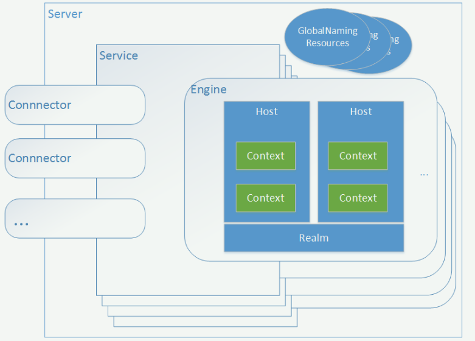

#### Tomcat介绍

##### 1.1 引入tomcat

- Tomcat是Apache 软件基金会（Apache Software Foundation）的Jakarta 项目中的一个核心项目，由Apache、Sun 和其他一些公司及个人共同开发而成。由于有了Sun 的参与和支持，最新的Servlet 和JSP 规范总是能在Tomcat 中得到体现，Tomcat 5支持最新的Servlet 2.4 和JSP 2.0 规范。因为Tomcat 技术先进、性能稳定，而且免费，因而深受Java 爱好者的喜爱并得到了部分软件开发商的认可，成为目前比较流行的Web 应用服务器

##### 1.2 常用的java-web服务开源软件

> `tomcat`、`resin`、`jboss`，商用的`WebLogic(BEA -> Oracle)`、`WebSphere(IBM)`

##### 1.3 Tomcat整体结构

* Server：即一个Tomcat实例

* Service：即一个Server对外提供的服务单元，一个Server下面可以有多个Service组件，用于把连接器Connector跟引擎Engine关联起来，一个Service只能包含一个Engine和一个或多个Connector组件

* Connector：连接器，用于服务组件对外的访问器，接收并解析用户请求，将请求映射为Engine中的运行代码；之后将运行结果构建成响应报文，一个服务组件可以有多个Connector子组件，不同Connector对应不同协议访问

* Engine：引擎，Tomcat的核心组件，用于运行JSP或Servlet代码，一个Service下有且仅有一个Engine

* Host：类似httpd的虚拟主机，用于定位服务访问的范围域，一个引擎下可以有多个虚拟主机，即除localhost外还可以是其他，另外虚拟主机还可以存在别名

* Context：上下文，类似httpd的alias，一个Host下可有存在多个独立的上下文，而一个上下文对应着我们发布的一个完整的应用

* Realm：用于定义容器内应用程序访问认证，位于Engine下，可以有多种实现，一般我们选择UserDatabaseRealm，该Realm读取conf/tomcat-users.xml中数据进行认证

* Value：扩展组件，用于表明上级组件具有的扩展属性，一个组件可以有多个Value组件，比如 org.apache.catalina.valves.AccessLogValve访问日志组件

* GlobalNamingResource：全局命名资源，也是全局配置问题，供所有组件按需读取与使用

> 每个组件都是由“类”来实现，有些组件实现不止一种，组件的分类

- 顶级类组件：server
- 服务类组件：service
- 容器类组件，即可以部署webapp的组件：engine/host/context
- 连接器组件：connector
- 被嵌套类组件：value/logger/realm

##### 1.4 Tomcat运行模式

- standalone ： 通过内置的 web server （http connector）来接收客户端请求
- proxy ： 由专门的web server服务客户端的http请求
       in-process: 部署于同一主机
       network: 部署不同主机

##### 1.5 配置文件

- server.xml   主配置文件
- context.xml  每个webapp都可以专用的配置文件，这些配置文件通常位于webapp应用程序目录下的WEB-INF目录中，用于定义会话管理器、JDBC等；conf/context.xml是为各webapp提供默认的配置
- web.xml      每个webapp“部署”之后才能被访问；此文件则用于为所有的webapp提供默认部署相关配置
- tomcat-users.xml  用户认证账号和密码的配置文件
- catalina.policy   当使用 -security 选项启动tomcat实例时会读取此配置文件来实现其安全运行策略
- catalina.properties  Java属性定义文件，用于设定类加载器路径等，以及一些JVM性能相关的调优参数
- logging.properties    日志文件配置参数

#### Java概念解释

* JDK

>简单的说JDK是面向开发人员使用的SDK，它提供了Java的开发环境和运行环境。SDK是Software Development Kit 一般指软件开发包，可以包括函数库、编译程序等

* JRE

>JRE(Java Runtime Environment，Java运行环境)，也就是Java平台。所有的Java程序都要在JRE下才能运行。JDK的工具也是Java程序，也需要JRE才能运行。为了保持JDK的独立性和完整性，在JDK的安装过程中，JRE也是安装的一部分。所以，在JDK的安装目录下有一个名为jre的目录，用于存放JRE文件。

* SDK

>SDK(Software Develop Kit，软件开发工具包)，用于帮助开发人员的提高工作效率。各种不同类型的软件开发，都可以有自己的SDK。Windows有Windows SDK，DirectX 有 DirectX 9 SDK，.NET开发也有Microsoft .NET Framework SDK。JAVA开发也不含糊，也有自己的Java SDK。

* JVM

>JVM(Java Virtual Machine，Java虚拟机）是JRE的一部分。它是一个虚构出来的计算机，是通过在实际的计算机上仿真模拟各种计算机功能来实现的。JVM有自己完善的硬件架构，如处理器、堆栈、寄存器等，还具有相应的指令系统。Java语言最重要的特点就是跨平台运行。使用JVM就是为了支持与操作系统无关，实现跨平台
