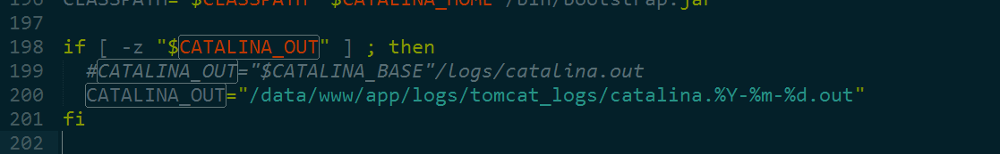
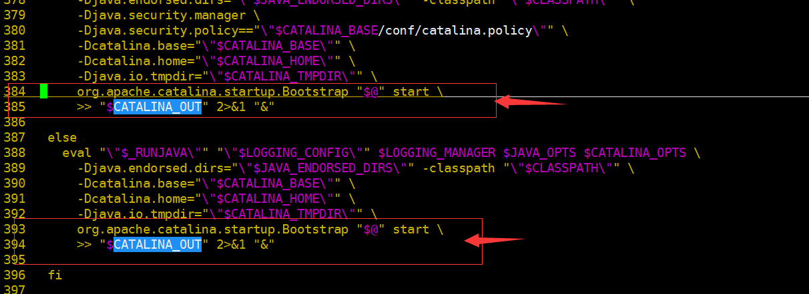
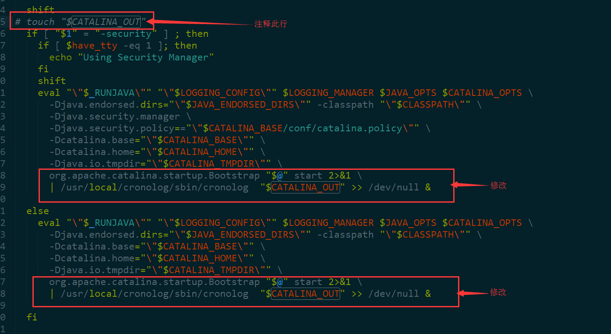
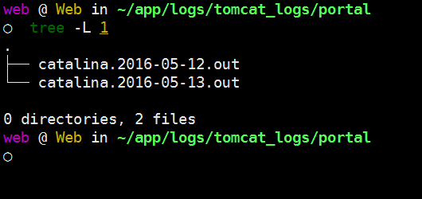
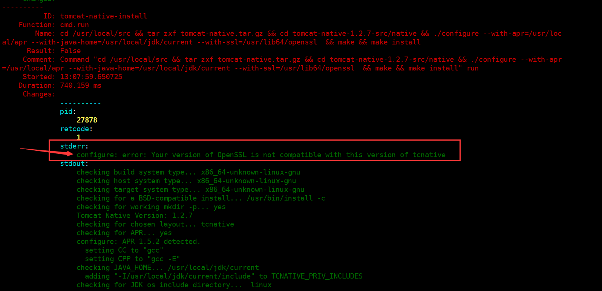
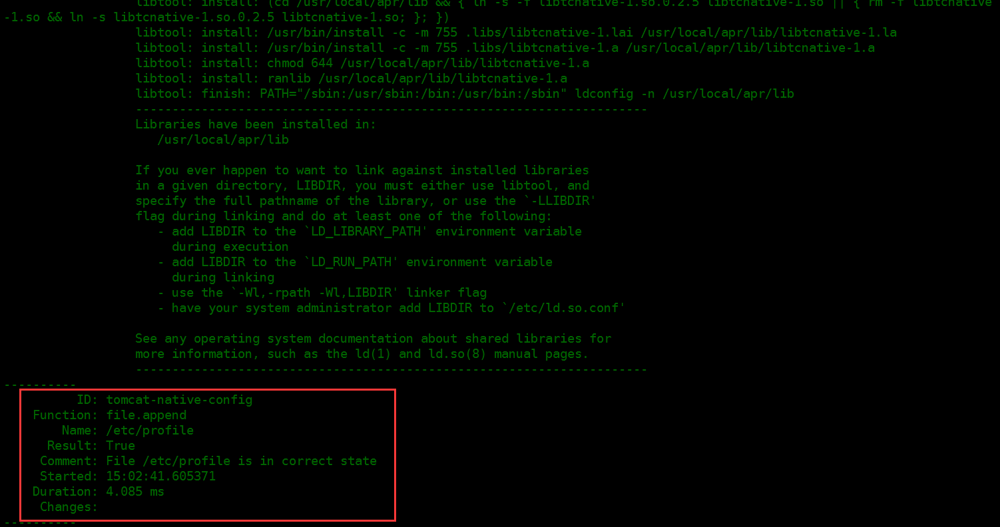

### Tomcat 调优

Tomcat 调优分为以下几点：

> 访问日志`localhost_access_log.txt`的优化

> 控制台日志`catalina.out`的优化

> `Tomcat`使用`Http11AprProtocol`协议

#### 1. 访问日志`localhost_access_log.txt`的优化

> `Tomcat`默认的访问日志记录存放在`$CATALINA_HOME/logs/localhost_access_log**.txt`，修改`$CATALINA_HOME/conf/server.xml`文件中内容：

```
<Valve className="org.apache.catalina.valves.AccessLogValve" directory="logs"
               prefix="localhost_access_log" suffix=".txt"
               pattern="%h %l %u %t &quot;%r&quot; %s %b %{Referer}i %{User-Agent}i %D" resolveHosts="false" />

```

> pattern属性值由字符串常量和pattern标识符加上前缀"%"组合而成，pattern标识符加上前缀"%"，用来代替当前请求/响应中的对应的变量值

| 格式    | 含义     |
| :------------- | :------------- |
|%a | 远程主机的IP|
|%A | 本机IP |
|%b | 发送字节数，不包含HTTP头|
|%B | 发送字节数，不包含HTTP头|
|%h | 远程主机名|
|%H | 请求的具体协议，HTTP/1.0 或 HTTP/1.1|
|%l | 远程用户名|
|%m | 请求方式，GET, POST, PUT (Request method)|
|%p | 本机端口|
|%q | 查询串|
|%r | HTTP请求中的第一行|
|%s | HTTP状态码|
|%S | 用户会话ID|
|%t | 访问日期和时间|
|%u | 已经验证的远程用户|
|%U | 请求的URL路径|
|%v | 本地服务器名 |
|%D | 处理请求所耗费的毫秒数|
|%T | 处理请求所耗费的秒数|
|%{Referer}i  |请求的Referer|
|%{User-Agent}i|请求的 User-Agent|
|...|...|

#### 2. 优化输出`catalina.out`

>优化输出`catalina.out`，包含用`cronolog`工具来切割日志文件，另外定义文件的名称按`yyyyMMdd`命令切分

>默认的tomcat输出log路径为`$CATALINA_HOME/log/catalina.out`，修改`$CATALINA_HOME/bin/catalina.sh`涉及的脚本：

a.修改输出格式



```
if [ -z "$CATALINA_OUT" ] ; then
  #CATALINA_OUT="$CATALINA_BASE"/logs/catalina.out
  CATALINA_OUT="/data/www/app/logs/tomcat_logs/catalina.%Y-%m-%d.out"
fi
```

b.注释`touch $CATALINA_OUT`并修改对应内容

>未修改效果：



>修改效果：



>脚本如下：

```
# touch "$CATALINA_OUT"
  if [ "$1" = "-security" ] ; then
  ...
eval "\"$_RUNJAVA\"" "\"$LOGGING_CONFIG\"" $LOGGING_MANAGER $JAVA_OPTS $CATALINA_OPTS \
     ...
     -Djava.io.tmpdir="\"$CATALINA_TMPDIR\"" \
     org.apache.catalina.startup.Bootstrap "$@" start 2>&1 \
     | /usr/local/cronolog/sbin/cronolog  "$CATALINA_OUT" >> /dev/null &

 else
   ...
     -Djava.io.tmpdir="\"$CATALINA_TMPDIR\"" \
     org.apache.catalina.startup.Bootstrap "$@" start 2>&1 \
     | /usr/local/cronolog/sbin/cronolog  "$CATALINA_OUT" >> /dev/null &

```

启动`Tomcat`，观察`catalina.out`已经按照日志格式切割如下：




#### 3. `Tomcat`使用`Http11AprProtocol(Apache Portable Runtime[APR])`协议

##### 3.1. `BIO`，`NIO`，`APR`区别

>在Tomcat中，缺省HTTP连接器BIO(Blocking I/O)低并发特性，为了提高Tomcat性能，可采用NIO(非阻塞 I/O)或APR(Apache Portable Runtime)连接器来提供更强性能，提升Web静态页面的处理能力，`apr` 与`tomcat-native`提供更好的伸缩性、性能和集成到本地服务器技术。

>>（1）BIO是最稳定最老的一个连接器，是采用阻塞的方式，意味着每个连接线程绑定到每个Http请求，直到获得Http响应返回，如果Http客户端请求的是keep-Alive连接，那么这些连接也许一直保持着直至达到timeout时间，这期间不能用于其它请求。

>>（2）NIO是利用java的异步io护理技术,noblocking IO技术想运行在该模式下，直接修改server.xml里的Connector节点,修改protocol为
`<Connector port="80″
protocol="org.apache.coyote.http11.Http11NioProtocol"
connectionTimeout="20000"
URIEncoding=”UTF-8″
useBodyEncodingForURI="true"
enableLookups="false"
redirectPort="8443">` 启动后,即可生效。

>>（3）APR是使用原生C语言编写的非堵塞I/O，Tomcat将以JNI的形式调用Apache HTTP服务器的核心动态链接库来处理文件读取或网络传输操作，从而大大地提高Tomcat对静态文件的处理性能， `APR`也是在Tomcat上运行高并发应用的首选模式。需要安装`apr`和`native`，直接启动就支持 `apr`，从操作系统级别来解决异步的IO问题,大幅度的提高性能。 使用时指定protocol为 `protocol=“org.apache.coyote.http11.Http11AprProtocol”` 可以到http://apr.apache.org/download.cgi 去下载，大致的安装步骤如下：

##### 3.2. 安装`apr`及配置

>APR需要的工作环境：

>>`APR library`

>>`JNI wrappers for APR used by Tomcat (libtcnative)`

>>`OpenSSL libraries`

###### A. 安装OpenSSL

>`# yum install openssl-devel`

###### B. `apr`安装

>yum源安装`apr`

>>`# yum -y install apr apr-devel`

>源码安装`apr`

>>`# ./configure --prefix=/usr/local/apr`

>若安装apr的时候出现`rm: cannot remove `libtoolT': No such file or directory`解决办法：

```
# vi configure
找到 $RM "$cfgfile" 前面加#注释掉：
#    $RM "$cfgfile"
```

> 然后重新`./configure` 并且 `make && sudo make install`

###### C. 安装`apr-iconv`

>`# ./configure --prefix=/usr/local/apr-iconv --with-apr=/usr/local/apr`

>`# make && make install`

###### D. 安装`apr-util`

>`# ./configure --prefix=/usr/local/apr-util --with-apr=/usr/local/apr --with-apr-iconv=/usr/local/apr-iconv/bin/apriconv`

>`# make && sudo make install`

###### E. 安装 JNI wrapper库 (libtcnative)

`tomcat-native`就在`Tomcat`的`bin`目录下有/tomcat-native.tar.gz，解压并安装步骤如下：

>`# tar zxvf tomcat-native.tar.gz`

>`# cd tomcat-native-1.2.7-src/native`

>`# ./configure --with-apr=/usr/local/apr`

>`# make && make install`

若出现`error: can't locate a valid JDK location`，需指定具体的`JAVA_HOME`，重新执行

>`./configure --with-apr=/usr/local/apr --with-java-home=/usr/local/jdk/current \
  --with-ssl=/usr/lib64/openssl`
>`# make`


或若使用`SaltStack`自动化部署出现如下错误：




需重新执行`configure`

```
./configure --with-apr=/usr/local/apr --with-java-home=/usr/local/jdk/current --with-ssl=/usr/lib64/openssl --disable-openssl-version-check
```
然后重新`# make && make install`

安装完成之后 会出现如下提示信息

```
Libraries have been installed in:
   /usr/local/apr/lib
```

表示在`/usr/local/apr/lib`下创建各种`tcnative`函数库


若使用`SaltStack`自动化部署，当执行 `salt 'Tomcat' state.highstate`，提示：



表示执行成功


###### F. 设置 `apr` 的环境变量

方法是在`catalina.sh`文件的`#!/bin/sh`下添加如下内容：

> `LD_LIBRARY_PATH=$LD_LIBRARY_PATH:/usr/local/apr/lib export LD_LIBRARY_PATH`

或在`/etc/profile`，添加

```
export LD_LIBRARY_PATH=$LD_LIBRARY_PATH:/usr/local/apr/lib
source /etc/profile
```

这样就只是给这个`Tomcat`添加了`APR`，不破坏其它`Tomcat`的配置。

###### G. 重新启动`Tomcat`

启动`Tomcat`查看日志信息，应该有类似如下的信息：


```
org.apache.catalina.core.AprLifecycleListener.lifecycleEvent Loaded APR based Apache Tomcat Native library 1.2.7 using APR version 1.5.2.
org.apache.catalina.core.AprLifecycleListener.lifecycleEvent APR capabilities: IPv6 [true], sendfile [true], accept filters [false], random [true].
org.apache.catalina.core.AprLifecycleListener.initializeSSL OpenSSL successfully initialized (OpenSSL 1.0.1e-fips 11 Feb 2013)
org.apache.coyote.AbstractProtocol.init Initializing ProtocolHandler ["http-apr-12121"]
```

若出现如下错误信息：

```
Tomcat SSLEngine Error
	SEVERE: Failed to initialize the SSLEngine.
	org.apache.tomcat.jni.Error: 70023: This function has not been implemented on this platform
    at org.apache.tomcat.jni.SSL.initialize(Native Method)
    at sun.reflect.NativeMethodAccessorImpl.invoke0(Native Method)
    at sun.reflect.NativeMethodAccessorImpl.invoke(NativeMethodAccessorImpl.java:57)
    at sun.reflect.DelegatingMethodAccessorImpl.invoke(DelegatingMethodAccessorImpl.java:43)
    at java.lang.reflect.Method.invoke(Method.java:606)
    at org.apache.catalina.core.AprLifecycleListener.initializeSSL(AprLifecycleListener.java:259)
    at org.apache.catalina.core.AprLifecycleListener.lifecycleEvent(AprLifecycleListener.java:110)
    at org.apache.catalina.util.LifecycleSupport.fireLifecycleEvent(LifecycleSupport.java:119)
    at org.apache.catalina.util.LifecycleBase.fireLifecycleEvent(LifecycleBase.java:90)
    at org.apache.catalina.util.LifecycleBase.setStateInternal(LifecycleBase.java:402)
    at org.apache.catalina.util.LifecycleBase.init(LifecycleBase.java:99)
    at org.apache.catalina.startup.Catalina.load(Catalina.java:640)
    at org.apache.catalina.startup.Catalina.load(Catalina.java:665)
    at sun.reflect.NativeMethodAccessorImpl.invoke0(Native Method)
    at sun.reflect.NativeMethodAccessorImpl.invoke(NativeMethodAccessorImpl.java:57)
    at sun.reflect.DelegatingMethodAccessorImpl.invoke(DelegatingMethodAccessorImpl.java:43)
    at java.lang.reflect.Method.invoke(Method.java:606)
    at org.apache.catalina.startup.Bootstrap.load(Bootstrap.java:281)
    at org.apache.catalina.startup.Bootstrap.main(Bootstrap.java:455)
```
需修改`Tomcat`主目录下的`/conf/server.xml`的配置如下:
`<Listener className="org.apache.catalina.core.AprLifecycleListener" SSLEngine="off" />`

关闭`Tomcat`查看日志信息，有类似如下信息：

```
Stopping ProtocolHandler ["http-apr-8080"]
Destroying ProtocolHandler ["http-apr-8080"]
```

###### H. `Tomcat`参考配置

```
 <Connector port="8080" protocol=" org.apache.coyote.http11.Http11AprProtocol "
	URIEncoding="UTF-8"    # UTF-8 编码
	maxConnections="10000"
	maxThreads="2000"
	acceptCount="2000" # 当所有可以使用的处理请求的线程数都被使用时，可以放到处理队列中的请求数，超过这个数即不予处理，允许的最大连接数，应大于等于maxProcessors，默认值为100
	minSpareThreads="100"  # 最小空闲线程
  maxSpareThreads="500" #一旦创建的线程数超过这个值，Tomcat就会关闭不再需要的Socket线程
	compression="on"     # 开启压缩
	compressionMinSize="2048" #  压缩的最小大小
	compressableMimeType="text/html,text/xml,text/javascript,text/css,text/plain"
	enableLookups="false"  # 禁用 DNS查询，是否反查域名，取值为：true或false。为了提高处理能力，应设置为false
	disableUploadTimeout="true" # 关闭下载超时
	connectionTimeout="20000" # 网络连接超时，单位：毫秒。设置为0表示永不超时，这样设置有隐患的。通常可设置为30000毫秒
  maxProcessors="1000" # 最大连接线程数，即：并发处理的最大请求数，默认值为75
  minProcessors="5"  # 最小空闲连接线程数，用于提高系统处理性能，默认值为10
  useURLValidationHack="false"
	redirectPort="8443"
  SSLEnabled="true" # 以下是 https 配置
  scheme="https"
  secure="true"
  clientAuth="false"
  sslProtocol="TLS"
  keystoreFile="/usr/local/tomcat/conf/demo.jks"
  keystorePass="Password"
  />
```

###### I. 优化网络参数(配置文件：`/etc/sysctl.cnf`)

```
net.core.netdev_max_backlog = 32768

net.core.somaxconn = 32768

net.core.wmem_default = 8388608

net.core.rmem_default = 8388608

net.core.rmem_max = 16777216

net.core.wmem_max = 16777216

net.ipv4.ip_local_port_range = 1024 65000

net.ipv4.route.gc_timeout = 100

net.ipv4.tcp_fin_timeout = 30

net.ipv4.tcp_keepalive_time = 1200

net.ipv4.tcp_timestamps = 0
net.ipv4.tcp_synack_retries = 2

net.ipv4.tcp_syn_retries = 2

net.ipv4.tcp_tw_recycle = 1

net.ipv4.tcp_tw_reuse = 1

net.ipv4.tcp_mem = 94500000 915000000 927000000

net.ipv4.tcp_max_orphans = 3276800

net.ipv4.tcp_max_syn_backlog = 65536
```

> 执行`sysctl -p`，让配置生效

>参考：

[Tomcat Native (APR) 1.2.5 release](http://sarc.io/index.php/apache-tomcat/400-tomcat-native-apr-1-2-5-release?ckattempt=1)
